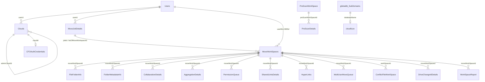

# CloudFuze Content Migration — MongoDB Design Reference

**Purpose:** Full reference for the production **content migration** MongoDB — relationships, every collection’s fields, and one sanitized sample document per collection — so agents-migration work can reuse the same organizational patterns.

**Introspected:** 2026-08-12T07:47:33.634Z
**Databases:** `cloudfuze` (app data), `globaldb` (platform/tenant config)
**Clouds observed:** `BOX_BUSINESS` → `SHAREPOINT_ONLINE_BUSINESS`

> **Security:** Credentials are not stored here. Secrets/tokens in samples are replaced with `[REDACTED]`. Arrays longer than 5 elements are truncated. Rotate any DB password that was shared in chat.

---

## Table of contents

1. [Mental model](#1-mental-model)
2. [ID conventions](#2-id-conventions)
3. [Lifecycle & status vocabularies](#3-lifecycle--status-vocabularies)
4. [Relationship diagram](#4-relationship-diagram)
5. [Join cheat-sheet](#5-join-cheat-sheet)
6. [Patterns for agents migration](#6-patterns-for-agents-migration)
7. [Collection catalog — `cloudfuze`](#7-collection-catalog--cloudfuze)
8. [Collection catalog — `globaldb`](#8-collection-catalog--globaldb)
9. [Empty collections](#9-empty-collections)

---

## 1. Mental model

Content migration is layered:

1. **Tenant / operator** — `Users` owns the portal login.
2. **Connected clouds** — `Clouds` (+ `CFOAuthCredentials`) hold source/destination identities.
3. **User mapping** — `MappingCache` / `CSVMappingCache` / `PermissionCache`.
4. **Job** — `MoveJobDetails` (ONETIME / DELTA + feature flags).
5. **Workspace (pair)** — `MoveWorkSpaces` = one source root → dest root. Almost all runtime state hangs off `moveWorkSpaceId`.
6. **Item ledgers** — `FolderMetadataInfo`, `FileFolderInfo`.
7. **Side processors** — collaborations, shared links, hyperlinks, permissions, conflicts, delta, reports.
8. **Pre-scan** — `PreScanWorkSpace` → `PreScanFileFolders` / `PreScanDetails`.

---

## 2. ID conventions

| Pattern | Where | Notes |
|---------|--------|-------|
| Mongo `ObjectId` `_id` | Most collections | Canonical PK |
| Stringified ObjectId | `userId`, `jobId`, `moveWorkSpaceId`, many `*CloudId` on item rows | Children usually store **strings** |
| Mongo `DBRef` | `MoveWorkSpaces.fromCloudId`, `toCloudId`, `userMini` | `{ $ref, $id, $db }` → `Clouds` / `Users` |
| Provider native IDs | `sourceId`, `destId`, `fromRootId`, `toRootId`, `memberId` | Opaque cloud API ids |
| `uniqueWorkSpaceId` | Workspaces + item rows | Stable across delta reruns |

**Join rule:** query child collections with the **string** form of `MoveWorkSpaces._id`, not `ObjectId(...)`.

---

## 3. Lifecycle & status vocabularies

```text
Users → Clouds (+ OAuth)
  → MappingCache / PermissionCache
  → optional PreScanWorkSpace
  → MoveJobDetails
       → MoveWorkSpaces
            → FolderMetadataInfo / FileFolderInfo
            → AggregationDetails, PermissionQueue, CollabarationDetails,
              SharedLinks*, HyperLinks*, Conflict*, DriveChange*, Reports
```

| Collection.field | Observed values |
|------------------|-----------------|
| `MoveJobDetails.jobStatus` | `COMPLETED`, `IN_PROGRESS` |
| `MoveWorkSpaces.processStatus` | `IN_PROGRESS`, `NOT_PROCESSED`, `PROCESSED`, `PROCESSED_WITH_SOME_CONFLICTS`, `SUSPENDED` |
| `FileFolderInfo.processStatus` | `PROCESSED`, `CONFLICT`, `MANUAL_FILE_RETRY`, `VERSION_PROCESSED`, `NON_RETRIABLE_VERSION` |
| `FolderMetadataInfo.processStatus` | `PROCESSED`, `CONFLICT`, `MANUAL_FOLDER_RETRY` |
| `CollabarationDetails.processStatus` | `PROCESSED`, `CONFLICT`, `IN_QUEUE`, `NOT_PROCESSED` |
| `PermissionQueue.processStatus` | `IN_PROGRESS`, `PROCESSED` |
| `HyperLinks.processStatus` | `PROCESSED`, `CONFLICT`, `NOT_STARTED`, `NOT_STARTED_MEDIUM`, `NOT_STARTED_LARGE` |
| `PreScanWorkSpace.processStatus` | `PROCESSED` |

---

## 4. Relationship diagram



---

## 5. Join cheat-sheet

| From | To | Join |
|------|----|------|
| `MoveJobDetails._id` | `MoveWorkSpaces.jobId` | string |
| `MoveJobDetails.listOfMoveWorkspaceId[]` | `MoveWorkSpaces._id` | string ↔ ObjectId |
| `MoveWorkSpaces.userMini.$id` | `Users._id` | DBRef |
| `MoveWorkSpaces.fromCloudId.$id` / `toCloudId.$id` | `Clouds._id` | DBRef |
| `MoveWorkSpaces._id` | most `*.moveWorkSpaceId` | ObjectId → **string** |
| `MoveWorkSpaces._id` | `Conflict*WorkSpace.workSpaceId`, `ExternalUserDetail.workSpaceId` | ObjectId → **string** |
| `Clouds.adminCloudId` | admin `Clouds._id` | id |
| `Clouds._id` | `CFOAuthCredentials.cloudId` | id |
| `Users._id` | `userId` on jobs/queues/items | ObjectId → **string** |
| `PreScanWorkSpace._id` | `PreScanDetails.preScanWorkSpaceId` | id |
| `globaldb.SubDomains.databaseName` | physical Mongo DB name | tenant router |

---

## 6. Patterns for agents migration

| Content migration | CS_GE analogue |
|-------------------|----------------|
| `Users` / subdomain DB | `appUserId` tenant key |
| `Clouds` source/dest | MS + Google connected accounts |
| `MoveJobDetails` | migration run / session |
| `MoveWorkSpaces` | one staged agent unit |
| `FileFolderInfo` / `FolderMetadataInfo` | `stagedAgents` + `agentIRCache` |
| `AggregationDetails` | run summary / SSE totals |
| collab / share queues | Gemini share / IAM side effects |
| reports + conflict statuses | fidelity notes (`lost` / `needs-review`) |
| `uniqueWorkSpaceId` + delta | idempotent re-migrate |

---

## 7. Collection catalog — `cloudfuze`

Populated collections: **55**. Empty (listed in §9): **57**.

### Index of populated collections

- [`Activites`](#cloudfuze-activites) — ~2,366 docs, 19 fields
- [`AgentDirectoryInfo`](#cloudfuze-agentdirectoryinfo) — ~4 docs, 38 fields
- [`AggregationDetails`](#cloudfuze-aggregationdetails) — ~780 docs, 40 fields
- [`categories`](#cloudfuze-categories) — ~69 docs, 8 fields
- [`CFOAuthCredentials`](#cloudfuze-cfoauthcredentials) — ~7 docs, 14 fields
- [`Clouds`](#cloudfuze-clouds) — ~2,650 docs, 65 fields
- [`CollabarationDetails`](#cloudfuze-collabarationdetails) — ~49,85,065 docs, 49 fields
- [`ConflictDeltaFolderWorkSpace`](#cloudfuze-conflictdeltafolderworkspace) — ~680 docs, 20 fields
- [`ConflictFileWorkSpace`](#cloudfuze-conflictfileworkspace) — ~1,920 docs, 22 fields
- [`ConflictFolderWorkSpace`](#cloudfuze-conflictfolderworkspace) — ~1,920 docs, 21 fields
- [`CSVMappingCache`](#cloudfuze-csvmappingcache) — ~190 docs, 23 fields
- [`DashBoardCsvDetails`](#cloudfuze-dashboardcsvdetails) — ~9 docs, 9 fields
- [`DeltaChangesMetaDataInfo`](#cloudfuze-deltachangesmetadatainfo) — ~706 docs, 32 fields
- [`DriveChangeIdDetails`](#cloudfuze-drivechangeiddetails) — ~2,943 docs, 26 fields
- [`EnvironmentDetails`](#cloudfuze-environmentdetails) — ~2 docs, 8 fields
- [`ExceptionTracking`](#cloudfuze-exceptiontracking) — ~2 docs, 7 fields
- [`ExternalUserDetail`](#cloudfuze-externaluserdetail) — ~6,230 docs, 10 fields
- [`FileController`](#cloudfuze-filecontroller) — ~1 docs, 9 fields
- [`FileFolderInfo`](#cloudfuze-filefolderinfo) — ~50,26,857 docs, 77 fields
- [`FileVersionRetryJobs`](#cloudfuze-fileversionretryjobs) — ~290 docs, 39 fields
- [`FolderDisplayUserInfo`](#cloudfuze-folderdisplayuserinfo) — ~4 docs, 14 fields
- [`FolderMetadataInfo`](#cloudfuze-foldermetadatainfo) — ~3,42,978 docs, 48 fields
- [`FolderRetryTracker`](#cloudfuze-folderretrytracker) — ~35 docs, 35 fields
- [`GroupDetails`](#cloudfuze-groupdetails) — ~142 docs, 9 fields
- [`GuestExternalUserDetails`](#cloudfuze-guestexternaluserdetails) — ~4 docs, 6 fields
- [`HashKey`](#cloudfuze-hashkey) — ~1 docs, 4 fields
- [`HyperLinkQueue`](#cloudfuze-hyperlinkqueue) — ~90 docs, 14 fields
- [`HyperLinks`](#cloudfuze-hyperlinks) — ~15,65,866 docs, 36 fields
- [`HyperLinksControl`](#cloudfuze-hyperlinkscontrol) — ~1 docs, 12 fields
- [`HyperLinkUrls`](#cloudfuze-hyperlinkurls) — ~1,822 docs, 26 fields
- [`MappingCache`](#cloudfuze-mappingcache) — ~24 docs, 51 fields
- [`Member`](#cloudfuze-member) — ~4,545 docs, 6 fields
- [`MetadataQueue`](#cloudfuze-metadataqueue) — ~4 docs, 7 fields
- [`MoveCount`](#cloudfuze-movecount) — ~1 docs, 3 fields
- [`MoveJobDetails`](#cloudfuze-movejobdetails) — ~18 docs, 52 fields
- [`MoveWorkSpaces`](#cloudfuze-moveworkspaces) — ~97 docs, 149 fields
- [`MoveWorkSpaceStatus`](#cloudfuze-moveworkspacestatus) — ~96 docs, 7 fields
- [`MultiUserMoveQueue`](#cloudfuze-multiusermovequeue) — ~96 docs, 15 fields
- [`PermissionCache`](#cloudfuze-permissioncache) — ~2,741 docs, 40 fields
- [`PermissionDetails`](#cloudfuze-permissiondetails) — ~4 docs, 9 fields
- [`PermissionQueue`](#cloudfuze-permissionqueue) — ~96 docs, 12 fields
- [`PreScanDetails`](#cloudfuze-prescandetails) — ~1,80,543 docs, 25 fields
- [`PreScanFileFolders`](#cloudfuze-prescanfilefolders) — ~15,41,392 docs, 42 fields
- [`PreScanWorkSpace`](#cloudfuze-prescanworkspace) — ~11 docs, 37 fields
- [`PriorityWorkspace`](#cloudfuze-priorityworkspace) — ~15 docs, 8 fields
- [`Settings`](#cloudfuze-settings) — ~16 docs, 16 fields
- [`SharedLinksDetails`](#cloudfuze-sharedlinksdetails) — ~1,225 docs, 18 fields
- [`SharedLinksQueue`](#cloudfuze-sharedlinksqueue) — ~82 docs, 9 fields
- [`SYNC CONFIGURATION`](#cloudfuze-sync-configuration) — ~3 docs, 4 fields
- [`ThreadControl`](#cloudfuze-threadcontrol) — ~1 docs, 23 fields
- [`UserAccountType`](#cloudfuze-useraccounttype) — ~16 docs, 6 fields
- [`UserDriveChanges`](#cloudfuze-userdrivechanges) — ~21,924 docs, 41 fields
- [`Users`](#cloudfuze-users) — ~5 docs, 75 fields
- [`UsersContentMigInfo`](#cloudfuze-userscontentmiginfo) — ~7 docs, 18 fields
- [`WorkSpaceReport`](#cloudfuze-workspacereport) — ~282 docs, 10 fields

### `Activites`

<a id="cloudfuze-activites"></a>

- **Database:** `cloudfuze`
- **Estimated documents:** 2,366
- **Field count (from samples):** 19

#### Indexes

- `_id_`: `{"_id":1}`
- `tstamp_-1`: `{"tstamp":-1}`
- `tstamp_1`: `{"tstamp":1}`
- `primaryEmail_1`: `{"primaryEmail":1}`

#### Fields

| Field path | Observed type(s) |
|------------|------------------|
| `_class` | string |
| `_id` | ObjectId |
| `activityType` | string |
| `contentLengthIn` | number |
| `contentLengthOut` | number |
| `host` | string |
| `ipAddress` | string |
| `message` | string |
| `methodIn` | string |
| `origin` | string |
| `parameterMap` | string |
| `pathIn` | string |
| `primaryEmail` | string |
| `source` | string |
| `status` | string |
| `tstamp` | Date |
| `type` | string |
| `uId` | string |
| `userAgent` | string |

#### Sample document

```json
{
  "_id": "ObjectId(6a195a04aa678e71c7e7baef)",
  "contentLengthOut": 0,
  "contentLengthIn": 0,
  "source": "USER",
  "tstamp": "2026-05-29T09:19:00.171Z",
  "uId": "ImproperUserId",
  "userAgent": "Mozilla/5.0 (Windows NT 10.0; Win64; x64) AppleWebKit/537.36 (KHTML, like Gecko) Chrome/130.0.0.0 Safari/537.36",
  "status": "ACTIVE",
  "message": "Created settings",
  "ipAddress": "208.70.248.69, 207.121.55.76",
  "pathIn": "/cloudfuze PathInfo/v1/report/entuser/add",
  "methodIn": "PUT",
  "origin": "https://nyrainc.cloudfuze.com",
  "host": "nyraincapis.cloudfuze.com",
  "parameterMap": "\nAddress: http://nyraincapis.cloudfuze.com/cloudfuze/services/v1/report/entuser/add\nEncoding: ISO-8859-1\nHttp-Method: PUT\nContent-Type: application/json\nHeaders: {Accept=[application/json, text/javascript, */*; q=0.01], accept-encoding=[gzip, deflate, br, zstd], accept-language=[en-US,en;q=0.9], connection=[close], Content-Length=[180], content-type=[application/json], cookie=[_hjSessionUser_25206…[truncated]",
  "activityType": "UNKNOWN",
  "type": "ACTIVITY",
  "_class": "Activity"
}
```

---

### `AgentDirectoryInfo`

<a id="cloudfuze-agentdirectoryinfo"></a>

- **Database:** `cloudfuze`
- **Estimated documents:** 4
- **Field count (from samples):** 38

#### Indexes

- `_id_`: `{"_id":1}`

#### Fields

| Field path | Observed type(s) |
|------------|------------------|
| `_class` | string |
| `_id` | ObjectId |
| `createdBy` | string |
| `createdTime` | Date |
| `deltaMigration` | boolean |
| `destCloudName` | string |
| `destId` | string |
| `destinationExist` | boolean |
| `destObjectName` | string |
| `destParent` | string |
| `destPath` | string |
| `duplicateFileFolder` | boolean |
| `errorDiscription` | string |
| `folder` | boolean |
| `folderProcessEndTime` | Date |
| `folderProcessStartTime` | Date |
| `has_collaborations` | boolean |
| `inLongFileNameFolder` | boolean |
| `isMovedLongNameFolder` | boolean |
| `jobId` | string |
| `longFileName` | boolean |
| `modifiedBy` | string |
| `moveWorkSpaceId` | string |
| `objectName` | string |
| `onlyInheritCollabs` | boolean |
| `preMigration` | boolean |
| `processStatus` | string |
| `retry` | number |
| `root` | boolean |
| `sourceId` | string |
| `sourceModifiedDate` | Date |
| `sourceParent` | string |
| `sourceTimeStamp` | Date |
| `srcPath` | string |
| `statusCode` | number |
| `uniqueId` | string |
| `userId` | string |
| `webUrl` | string |

#### Sample document

```json
{
  "_id": "ObjectId(6786a74f0e6aa5043fec8d00)",
  "sourceId": "1F9B_sj6rGHTbrpdAGuZRw-RC59kt0rtY",
  "destId": "01IYLKRQNC5KETKG4V35ALEUVFS7OYCOZ6",
  "destParent": "01IYLKRQNC5KETKG4V35ALEUVFS7OYCOZ6",
  "userId": "670e67718f567f319d78af3f",
  "moveWorkSpaceId": "6786a2f2b63e4a45970b960d",
  "jobId": "6786a2f2b63e4a45970b960c",
  "statusCode": 0,
  "processStatus": "PROCESSED",
  "folderProcessStartTime": "2025-01-14T18:05:13.074Z",
  "folderProcessEndTime": "2025-01-14T18:05:14.753Z",
  "srcPath": "/comprasion delta prod/folder images",
  "destPath": "/comprasion delta prod/TESTTT",
  "longFileName": false,
  "isMovedLongNameFolder": false,
  "root": true,
  "webUrl": "",
  "inLongFileNameFolder": false,
  "retry": 0,
  "preMigration": false,
  "deltaMigration": true,
  "destinationExist": true,
  "has_collaborations": false,
  "destCloudName": "ONEDRIVE_BUSINESS_ADMIN",
  "folder": false,
  "duplicateFileFolder": false,
  "onlyInheritCollabs": false,
  "_class": "AgentDirectoryInfo"
}
```

---

### `AggregationDetails`

<a id="cloudfuze-aggregationdetails"></a>

- **Database:** `cloudfuze`
- **Estimated documents:** 780
- **Field count (from samples):** 40

#### Indexes

- `_id_`: `{"_id":1}`

#### Fields

| Field path | Observed type(s) |
|------------|------------------|
| `_class` | string |
| `_id` | ObjectId |
| `cancel` | number |
| `cancelSize` | number |
| `conflict` | number |
| `conflictSize` | number |
| `createdTime` | Date |
| `deltaMigration` | boolean |
| `fromCloudName` | string |
| `inProgress` | number |
| `inProgressSize` | number |
| `inQueue` | number |
| `inQueueSize` | number |
| `jobCreatedTime` | Date |
| `jobId` | string |
| `moveWorkSpaceId` | string |
| `notProcessed` | number |
| `notProcessedSize` | number |
| `notStarted` | number |
| `notStartedLarge` | number |
| `notStartedLargeSize` | number |
| `notStartedMedium` | number |
| `notStartedMediumSize` | number |
| `notStartedSize` | number |
| `pause` | number |
| `pauseSize` | number |
| `processed` | number |
| `processedSize` | number |
| `retrying` | number |
| `retryingSize` | number |
| `status` | string |
| `suspended` | number |
| `suspendedSize` | number |
| `toCloudName` | string |
| `type` | string |
| `userId` | string |
| `versionNotProcessed` | number |
| `versionNotProcessedSize` | number |
| `versionProcessed` | number |
| `versionProcessedSize` | number |

#### Sample document

```json
{
  "_id": "ObjectId(67b89e5d0b969c1b4f50b371)",
  "userId": "668ff266bfeba2552f674b5d",
  "jobId": "670e76568f567f319d78b0f9",
  "moveWorkSpaceId": "670e76568f567f319d78b0fa",
  "processed": 0,
  "inProgress": 0,
  "notProcessed": 0,
  "conflict": 0,
  "versionNotProcessed": 0,
  "versionProcessed": 0,
  "suspended": 0,
  "inQueue": 0,
  "notStarted": 0,
  "pause": 0,
  "cancel": 0,
  "retrying": 0,
  "notStartedMedium": 0,
  "notStartedLarge": 0,
  "processedSize": 0,
  "inProgressSize": 0,
  "notProcessedSize": 0,
  "conflictSize": 0,
  "versionNotProcessedSize": 0,
  "versionProcessedSize": 0,
  "notStartedMediumSize": 0,
  "notStartedLargeSize": 0,
  "pauseSize": 0,
  "notStartedSize": 0,
  "suspendedSize": 0,
  "inQueueSize": 0,
  "cancelSize": 0,
  "retryingSize": 0,
  "fromCloudName": "BOX_BUSINESS",
  "toCloudName": "ONEDRIVE_BUSINESS_ADMIN",
  "deltaMigration": false,
  "jobCreatedTime": "2024-10-15T14:04:22.236Z",
  "createdTime": "2025-02-21T15:40:13.171Z",
  "type": "FOLDERS",
  "status": "IN_PROGRESS",
  "_class": "AggregationDetails"
}
```

---

### `categories`

<a id="cloudfuze-categories"></a>

- **Database:** `cloudfuze`
- **Estimated documents:** 69
- **Field count (from samples):** 8

#### Indexes

- `_id_`: `{"_id":1}`

#### Fields

| Field path | Observed type(s) |
|------------|------------------|
| `_class` | string |
| `_id` | ObjectId |
| `categoryName` | string |
| `createdDate` | Date |
| `isSystem` | boolean |
| `modifiedDate` | Date |
| `regex` | array<string> |
| `type` | string |

#### Sample document

```json
{
  "_id": "ObjectId(6675c7c0e47a555d3238621c)",
  "categoryName": "Documents",
  "createdDate": "2024-06-21T18:34:40.494Z",
  "modifiedDate": "2024-06-21T18:34:40.495Z",
  "isSystem": true,
  "regex": [
    "doc"
  ],
  "type": "CATEGORY",
  "_class": "Category"
}
```

---

### `CFOAuthCredentials`

<a id="cloudfuze-cfoauthcredentials"></a>

- **Database:** `cloudfuze`
- **Estimated documents:** 7
- **Field count (from samples):** 14

#### Indexes

- `_id_`: `{"_id":1}`
- `cloudId_hashed`: `{"cloudId":"hashed"}`
- `lastRefreshTime_1`: `{"lastRefreshTime":1}`

#### Fields

| Field path | Observed type(s) |
|------------|------------------|
| `_class` | string |
| `_id` | string |
| `accessToken` | string |
| `adminAccessToken` | string |
| `authorizationCode` | string |
| `cloudId` | string |
| `expirationTimeMillis` | number |
| `lastAdminRefreshTime` | Date |
| `lastGraphRefreshTime` | Date |
| `lastRefreshTime` | Date |
| `memberId` | string |
| `migrationAccessToken` | string |
| `migrationAuthorizationCode` | string |
| `refreshToken` | string |

#### Sample document

```json
{
  "_id": "SHAREPOINT_ONLINE_BUSINESS|erik@voohalu.co",
  "accessToken": "[REDACTED]",
  "cloudId": "6a195b50aa678e71c7e7bb05",
  "expirationTimeMillis": 3600000,
  "lastRefreshTime": "2026-05-29T09:24:33.358Z",
  "lastGraphRefreshTime": "2026-05-29T09:24:33.885Z",
  "lastAdminRefreshTime": "2026-05-29T09:24:34.150Z",
  "refreshToken": "[REDACTED]",
  "authorizationCode": "[REDACTED]",
  "memberId": "28b59a23-0122-4a4a-b9d4-e3b217fb20b1",
  "migrationAccessToken": "[REDACTED]",
  "migrationAuthorizationCode": "[REDACTED]",
  "adminAccessToken": "[REDACTED]",
  "_class": "CFOAuthCredential"
}
```

---

### `Clouds`

<a id="cloudfuze-clouds"></a>

- **Database:** `cloudfuze`
- **Estimated documents:** 2,650
- **Field count (from samples):** 65

#### Indexes

- `_id_`: `{"_id":1}`
- `userId_hashed`: `{"userId":"hashed"}`
- `cloudUserId_hashed`: `{"cloudUserId":"hashed"}`
- `emailId_1`: `{"emailId":1}`
- `userId_1_cloudName_1`: `{"userId":1,"cloudName":1}`
- `adminCloudId_hashed`: `{"adminCloudId":"hashed"}`
- `userId_1_cloudName_1_userType_1`: `{"userId":1,"cloudName":1,"userType":1}`
- `userId_1_adminCloudId_1_deleted_1`: `{"userId":1,"adminCloudId":1,"deleted":1}`
- `adminCloudId_1_emailId_1_cloudName_1`: `{"adminCloudId":1,"emailId":1,"cloudName":1}`
- `userId_1_emailId_1_adminCloudId_1_deleted_1`: `{"userId":1,"emailId":1,"adminCloudId":1,"deleted":1}`
- `userId_1_statusCode_1_adminCloudId_1_deleted_1`: `{"userId":1,"statusCode":1,"adminCloudId":1,"deleted":1}`
- `userId_1_rootFolderId_1_adminCloudId_1_deleted_1`: `{"userId":1,"rootFolderId":1,"adminCloudId":1,"deleted":1}`
- `userId_1_adminCloudId_1_deleted_1_memberId_1`: `{"userId":1,"adminCloudId":1,"deleted":1,"memberId":1}`
- `userId_1_adminCloudId_1_memberId_1`: `{"userId":1,"adminCloudId":1,"memberId":1}`
- `loadLock_1_lastRefreshTime_1`: `{"loadLock":1,"lastRefreshTime":1}`
- `cloudName_1_userType_1_cfoAuthCredential_1`: `{"cloudName":1,"userType":1,"cfoAuthCredential":1}`

#### Fields

| Field path | Observed type(s) |
|------------|------------------|
| `_class` | string |
| `_id` | ObjectId |
| `addedPartially` | boolean |
| `adminCloudId` | string |
| `agentCloud` | boolean |
| `apiUpdate` | boolean |
| `azureFileShare` | boolean |
| `businessCloud` | boolean |
| `cfConnect` | boolean |
| `cfoAuthCredential` | DBRef |
| `cloudAddingStatus` | boolean |
| `cloudName` | string |
| `cloudStatus` | string |
| `cloudUserId` | string |
| `deleted` | boolean |
| `deltaChangeId` | string |
| `disableGroups` | boolean |
| `domainList` | array<string> |
| `domainName` | string |
| `elapsedTime` | number |
| `emailAlerts` | boolean |
| `emailId` | string |
| `endTime` | number |
| `errorDescription` | string |
| `externalUser` | boolean |
| `filesCount` | number |
| `filesFoldersCount` | number |
| `foldersCount` | number |
| `folderStructureReport` | string |
| `governmentCloud` | boolean |
| `hasOwnOauth` | boolean |
| `isAdmin` | boolean |
| `lastRefreshTime` | Date |
| `loadLock` | boolean |
| `mailSent` | boolean |
| `markSyncable` | boolean |
| `memberId` | string |
| `metadataUrl` | string |
| `migrationMetaDataUrl` | string |
| `notProvisioned` | number |
| `priority` | number |
| `provisionedClouds` | number |
| `reauthorization` | boolean |
| `reauthorize` | boolean |
| `restrictCsvCreator` | boolean |
| `role` | string |
| `rootFolderId` | string |
| `securityGroupCreation` | boolean |
| `separateLongFilePath` | boolean |
| `startTime` | number |
| `statusCode` | number |
| `suspended` | boolean |
| `syncGroups` | string |
| `syncStatusFlag` | boolean |
| `timeZone` | string |
| `totalSpace` | Long \\| number |
| `totolClouds` | number |
| `type` | string |
| `usedSpace` | number |
| `userDisplayName` | string |
| `userErrorDescription` | string |
| `userId` | string |
| `userType` | string |
| `utcDate` | string |
| `utcDateForDeletedUsers` | string |

#### Sample document

```json
{
  "_id": "ObjectId(6a195a9faa678e71c7e7baf5)",
  "cloudName": "BOX_BUSINESS",
  "cloudStatus": "ACTIVE",
  "externalUser": false,
  "timeZone": "America/Los_Angeles",
  "mailSent": false,
  "apiUpdate": false,
  "folderStructureReport": "NOT_PROCESSED",
  "userId": "6a195a03aa678e71c7e7baec",
  "loadLock": false,
  "filesCount": 0,
  "foldersCount": 0,
  "filesFoldersCount": 0,
  "syncStatusFlag": false,
  "isAdmin": true,
  "userType": "ADMIN",
  "domainList": [
    "cloudfuze.co"
  ],
  "emailId": "Lewis@cloudfuze.co",
  "domainName": "cloudfuze.co",
  "cloudAddingStatus": true,
  "totolClouds": 6,
  "provisionedClouds": 2,
  "notProvisioned": 4,
  "statusCode": 200,
  "reauthorization": "[REDACTED]",
  "emailAlerts": false,
  "restrictCsvCreator": false,
  "deleted": false,
  "utcDate": "2026-05-29T09:21:35.125Z",
  "utcDateForDeletedUsers": "2026-05-29T09:21:35.125Z",
  "reauthorize": false,
  "governmentCloud": false,
  "disableGroups": false,
  "businessCloud": false,
  "suspended": false,
  "agentCloud": false,
  "azureFileShare": false,
  "cfConnect": false,
  "role": "coadmin",
  "addedPartially": false,
  "syncGroups": "NOT_PROCESSED",
  "securityGroupCreation": false,
  "memberId": "3478979595",
  "adminCloudId": "6a195a9faa678e71c7e7baf5",
  "userDisplayName": "Lewis",
  "totalSpace": 32212254720,
  "usedSpace": 122627,
  "cloudUserId": "BOX_BUSINESS|Lewis@cloudfuze.co",
  "rootFolderId": "0",
  "priority": 1,
  "startTime": 0,
  "endTime": 0,
  "elapsedTime": 0,
  "markSyncable": false,
  "hasOwnOauth": false,
  "separateLongFilePath": false,
  "cfoAuthCredential": "[REDACTED]",
  "lastRefreshTime": "2026-05-29T09:21:36.787Z",
  "type": "CLOUD",
  "_class": "Cloud"
}
```

---

### `CollabarationDetails`

<a id="cloudfuze-collabarationdetails"></a>

- **Database:** `cloudfuze`
- **Estimated documents:** 49,85,065
- **Field count (from samples):** 49

#### Indexes

- `_id_`: `{"_id":1}`
- `processStatus_1`: `{"processStatus":1}`
- `processStatus_1_moveWorkSpaceId_1`: `{"processStatus":1,"moveWorkSpaceId":1}`
- `processStatus_1_retry_1_moveWorkSpaceId_1`: `{"processStatus":1,"retry":1,"moveWorkSpaceId":1}`
- `moveWorkSpaceId_1_root_1_sorceParent_1_processStatus_1`: `{"moveWorkSpaceId":1,"root":1,"sorceParent":1,"processStatus":1}`
- `moveWorkSpaceId_1`: `{"moveWorkSpaceId":1}`
- `moveWorkSpaceId_1_sourceId_1`: `{"moveWorkSpaceId":1,"sourceId":1}`
- `processStatus_1_folder_1`: `{"processStatus":1,"folder":1}`
- `userId_1`: `{"userId":1}`
- `userId_1_processStatus_1`: `{"userId":1,"processStatus":1}`
- `moveWorkSpaceId_1_processStatus_1`: `{"moveWorkSpaceId":1,"processStatus":1}`
- `userId_1_folder_1_processStatus_1`: `{"userId":1,"folder":1,"processStatus":1}`
- `userId_1_sourceId_1`: `{"userId":1,"sourceId":1}`
- `createdTime_1`: `{"createdTime":1}`

#### Fields

| Field path | Observed type(s) |
|------------|------------------|
| `_class` | string |
| `_id` | ObjectId |
| `createdTime` | Date |
| `destCollabarators` | array<string> |
| `destId` | string |
| `destinationSharedLink` | null |
| `destParent` | string |
| `destPath` | string |
| `destSharedLink` | boolean |
| `disableGroups` | boolean |
| `duplicateFileFolder` | boolean |
| `errorCollabarators` | array \\| null |
| `errorGroupNames` | array |
| `folder` | boolean |
| `forceRetry` | boolean |
| `fromCloudId` | string |
| `groupNames` | array \\| array<string> |
| `has_collabarations` | boolean |
| `has_noAccess` | boolean |
| `hasExternalCollab` | boolean |
| `inheritCollabarators` | array |
| `inLongFileNameFolder` | boolean |
| `invitedCollabaratorEmail` | array |
| `isMultiUserFileShared` | boolean |
| `jobId` | string |
| `longSrcPath` | boolean |
| `modifiedTime` | Date |
| `moveWorkSpaceId` | string |
| `notInDestEmails` | array |
| `objectName` | string |
| `onlyInheritCollabs` | boolean |
| `processStatus` | string |
| `retry` | number |
| `root` | boolean |
| `rootFile` | boolean |
| `scriptExcute` | boolean |
| `sharedFolderId` | null |
| `shareLinkAccess` | string |
| `sorceParent` | string |
| `sourceId` | string |
| `sourceModifiedDate` | Date |
| `sourcePath` | string |
| `sourceSharedLink` | null \\| string |
| `sourceTimeStamp` | Date |
| `srcCollabarators` | array<string> |
| `srcGroups` | array \\| array<string> |
| `srcsharedlink` | boolean |
| `toCloudId` | string |
| `userId` | string |

#### Sample document

```json
{
  "_id": "ObjectId(6a1992a5f2784439528f7d68)",
  "objectName": "NEWDATA",
  "fromCloudId": "6a198f42aa678e71c7e7bb49",
  "toCloudId": "6a199112aa678e71c7e7bb96",
  "moveWorkSpaceId": "6a199269aa678e71c7e7c0eb",
  "sourceId": "339961959977",
  "jobId": "6a199269aa678e71c7e7c0ea",
  "destId": "b!2fvNgr6JRkCXYr6s0sjLko2Ytj-yUFlBkgbjrudrkepgpOLD142BT7TcDNMfD3z6/01FQIO3MYSGORQHVEIQ5E226BDN5P7XWKO",
  "forceRetry": false,
  "createdTime": "2026-05-29T13:20:37.888Z",
  "processStatus": "PROCESSED",
  "has_collabarations": true,
  "has_noAccess": false,
  "longSrcPath": false,
  "destSharedLink": false,
  "srcsharedlink": false,
  "sourcePath": "/NEWDATA",
  "destPath": "/CHECKIN/Documents/SharePoint test",
  "folder": true,
  "root": true,
  "inLongFileNameFolder": false,
  "retry": 0,
  "isMultiUserFileShared": false,
  "scriptExcute": false,
  "duplicateFileFolder": false,
  "hasExternalCollab": false,
  "userId": "6a198128aa678e71c7e7bb40",
  "disableGroups": false,
  "rootFile": false,
  "onlyInheritCollabs": false,
  "_class": "CollabarationDetails",
  "modifiedTime": "2026-05-29T13:26:30.223Z",
  "destCollabarators": [
    "alex@filefuze.co",
    "21943807458__U_DELETED__@voohalu.co"
  ],
  "destinationSharedLink": null,
  "errorCollabarators": [],
  "errorGroupNames": [],
  "groupNames": [],
  "inheritCollabarators": [],
  "invitedCollabaratorEmail": [],
  "notInDestEmails": [],
  "sharedFolderId": null,
  "sourceSharedLink": null,
  "srcCollabarators": [
    "alex@filefuze.co",
    "21943807458__U_DELETED__@voohalu.co"
  ],
  "srcGroups": []
}
```

---

### `ConflictDeltaFolderWorkSpace`

<a id="cloudfuze-conflictdeltafolderworkspace"></a>

- **Database:** `cloudfuze`
- **Estimated documents:** 680
- **Field count (from samples):** 20

#### Indexes

- `_id_`: `{"_id":1}`

#### Fields

| Field path | Observed type(s) |
|------------|------------------|
| `_class` | string |
| `_id` | ObjectId |
| `conflictCount` | number |
| `conflictDeltaFolders` | boolean |
| `deltaMigration` | boolean |
| `enableRetry` | boolean |
| `fetchConflictCount` | boolean |
| `fileSize` | number |
| `folderErrorMessage` | string |
| `fromCloudName` | string |
| `jobId` | string |
| `ownerEmailId` | string |
| `processStatus` | string |
| `retriedFolders` | boolean |
| `retryCount` | number |
| `retryFoldersCount` | number |
| `toCloudName` | string |
| `userErrorMessage` | string |
| `userId` | string |
| `workSpaceId` | string |

#### Sample document

```json
{
  "_id": "ObjectId(6a1d34d2f2784439528f7d6a)",
  "userId": "6a198128aa678e71c7e7bb40",
  "jobId": "6a1d34abaa678e71c7e7c107",
  "workSpaceId": "6a1d34abaa678e71c7e7c108",
  "fromCloudName": "BOX_BUSINESS",
  "toCloudName": "SHAREPOINT_ONLINE_BUSINESS",
  "folderErrorMessage": "File/Folder name contains special character which are not allowed",
  "userErrorMessage": "BadRequest",
  "processStatus": "NOT_PROCESSED",
  "conflictDeltaFolders": false,
  "retryCount": 0,
  "retryFoldersCount": 0,
  "deltaMigration": true,
  "conflictCount": 0,
  "ownerEmailId": "soumya.gande@cloudfuze.com",
  "fetchConflictCount": false,
  "fileSize": 0,
  "retriedFolders": false,
  "enableRetry": false,
  "_class": "ConflictDeltaFolderWorkSpace"
}
```

---

### `ConflictFileWorkSpace`

<a id="cloudfuze-conflictfileworkspace"></a>

- **Database:** `cloudfuze`
- **Estimated documents:** 1,920
- **Field count (from samples):** 22

#### Indexes

- `_id_`: `{"_id":1}`
- `workSpaceId_1_processStatus_1_conflictFiles_1_userErrorMessage_1`: `{"workSpaceId":1,"processStatus":1,"conflictFiles":1,"userErrorMessage":1}`
- `jobId_1_processStatus_1_conflictFiles_1_userErrorMessage_1`: `{"jobId":1,"processStatus":1,"conflictFiles":1,"userErrorMessage":1}`
- `userId_1_processStatus_1_conflictFiles_1_userErrorMessage_1`: `{"userId":1,"processStatus":1,"conflictFiles":1,"userErrorMessage":1}`

#### Fields

| Field path | Observed type(s) |
|------------|------------------|
| `_class` | string |
| `_id` | ObjectId |
| `conflictCount` | number |
| `conflictFiles` | boolean |
| `deltaMigration` | boolean |
| `enableRetry` | boolean |
| `fetchConflictCount` | boolean |
| `fileErrorMessage` | string |
| `fileSize` | number |
| `forceRetry` | boolean |
| `fromCloudName` | string |
| `jobId` | string |
| `ownerEmailId` | string |
| `processStatus` | string |
| `retriedFiles` | boolean |
| `retryCount` | number |
| `retryFilesCount` | number |
| `toCloudName` | string |
| `userErrorMessage` | string |
| `userId` | string |
| `version` | boolean |
| `workSpaceId` | string |

#### Sample document

```json
{
  "_id": "ObjectId(6a19929df2784439528f7d3e)",
  "userId": "6a198128aa678e71c7e7bb40",
  "jobId": "6a199269aa678e71c7e7c0ea",
  "workSpaceId": "6a199269aa678e71c7e7c0eb",
  "fromCloudName": "BOX_BUSINESS",
  "toCloudName": "SHAREPOINT_ONLINE_BUSINESS",
  "fileErrorMessage": "File/Folder name contains special character which are not allowed",
  "userErrorMessage": "BadRequest",
  "processStatus": "NOT_PROCESSED",
  "conflictFiles": false,
  "retryCount": 0,
  "retryFilesCount": 0,
  "deltaMigration": false,
  "conflictCount": 0,
  "forceRetry": false,
  "ownerEmailId": "soumya.gande@cloudfuze.com",
  "fetchConflictCount": false,
  "fileSize": 0,
  "retriedFiles": false,
  "enableRetry": false,
  "version": true,
  "_class": "ConflictFileWorkSpace"
}
```

---

### `ConflictFolderWorkSpace`

<a id="cloudfuze-conflictfolderworkspace"></a>

- **Database:** `cloudfuze`
- **Estimated documents:** 1,920
- **Field count (from samples):** 21

#### Indexes

- `_id_`: `{"_id":1}`
- `workSpaceId_1`: `{"workSpaceId":1}`

#### Fields

| Field path | Observed type(s) |
|------------|------------------|
| `_class` | string |
| `_id` | ObjectId |
| `conflictCount` | number |
| `conflictFolders` | boolean |
| `deltaMigration` | boolean |
| `enableRetry` | boolean |
| `fetchConflictCount` | boolean |
| `fileSize` | number |
| `folderErrorMessage` | string |
| `forceRetry` | boolean |
| `fromCloudName` | string |
| `jobId` | string |
| `ownerEmailId` | string |
| `processStatus` | string |
| `retriedFolders` | boolean |
| `retryCount` | number |
| `retryFoldersCount` | number |
| `toCloudName` | string |
| `userErrorMessage` | string |
| `userId` | string |
| `workSpaceId` | string |

#### Sample document

```json
{
  "_id": "ObjectId(6a19929df2784439528f7d52)",
  "userId": "6a198128aa678e71c7e7bb40",
  "jobId": "6a199269aa678e71c7e7c0ea",
  "workSpaceId": "6a199269aa678e71c7e7c0eb",
  "fromCloudName": "BOX_BUSINESS",
  "toCloudName": "SHAREPOINT_ONLINE_BUSINESS",
  "folderErrorMessage": "File/Folder name contains special character which are not allowed",
  "userErrorMessage": "BadRequest",
  "processStatus": "NOT_PROCESSED",
  "conflictFolders": false,
  "retryCount": 0,
  "forceRetry": false,
  "retryFoldersCount": 0,
  "deltaMigration": false,
  "conflictCount": 0,
  "ownerEmailId": "soumya.gande@cloudfuze.com",
  "fetchConflictCount": false,
  "fileSize": 0,
  "retriedFolders": false,
  "enableRetry": false,
  "_class": "ConflictFolderWorkSpace"
}
```

---

### `CSVMappingCache`

<a id="cloudfuze-csvmappingcache"></a>

- **Database:** `cloudfuze`
- **Estimated documents:** 190
- **Field count (from samples):** 23

#### Indexes

- `_id_`: `{"_id":1}`
- `userId_1_csvId_1`: `{"userId":1,"csvId":1}`

#### Fields

| Field path | Observed type(s) |
|------------|------------------|
| `_class` | string |
| `_id` | ObjectId |
| `admin` | boolean |
| `createdTime` | Date |
| `csv` | boolean |
| `csvId` | number |
| `csvName` | string |
| `destCloudId` | string |
| `destEmailId` | string |
| `destFolderPath` | string |
| `destPathReview` | string |
| `destValidPath` | string |
| `failMapping` | boolean |
| `insertOrder` | number |
| `sourceCloudId` | string |
| `sourceEmailId` | string |
| `sourceFolderPath` | string |
| `sourcePathReview` | string |
| `sourceValidPath` | string |
| `standardUser` | boolean |
| `teamFolder` | boolean |
| `userId` | string |
| `validationStatus` | boolean |

#### Sample document

```json
{
  "_id": "ObjectId(66911debbfeba2552f674e4b)",
  "userId": "668ffb13bfeba2552f674b61",
  "sourceEmailId": "max@snapbot.io",
  "sourceFolderPath": "/",
  "destEmailId": "max@snapbot.io",
  "destFolderPath": "/Team Migration/Documents",
  "sourcePathReview": "PASS",
  "sourceValidPath": "",
  "destPathReview": "PASS",
  "destValidPath": "",
  "sourceCloudId": "6690fa92bfeba2552f674c67",
  "destCloudId": "66911dcabfeba2552f674db0",
  "csvName": "boxtoonedrive-Report.csv",
  "csvId": 950,
  "csv": true,
  "insertOrder": 0,
  "teamFolder": false,
  "admin": false,
  "standardUser": false,
  "failMapping": false,
  "validationStatus": false,
  "createdTime": "2024-07-12T12:13:31.783Z",
  "_class": "CSVMappingCache"
}
```

---

### `DashBoardCsvDetails`

<a id="cloudfuze-dashboardcsvdetails"></a>

- **Database:** `cloudfuze`
- **Estimated documents:** 9
- **Field count (from samples):** 9

#### Indexes

- `_id_`: `{"_id":1}`

#### Fields

| Field path | Observed type(s) |
|------------|------------------|
| `_class` | string |
| `_id` | ObjectId |
| `createdTime` | Date |
| `csvStatus` | string |
| `csvType` | string |
| `downloaded` | boolean |
| `moveWorkSpaceId` | string |
| `ownerEmailId` | string |
| `userId` | string |

#### Sample document

```json
{
  "_id": "ObjectId(6a340bc919999b4672aefc14)",
  "userId": "6a195c5faa678e71c7e7bb36",
  "ownerEmailId": "helpdesk@nyrainc.com",
  "createdTime": "2026-06-18T15:16:25.219Z",
  "downloaded": true,
  "csvType": "WORKSPACE",
  "csvStatus": "PROCESSED",
  "_class": "DashBoardCsvDetails"
}
```

---

### `DeltaChangesMetaDataInfo`

<a id="cloudfuze-deltachangesmetadatainfo"></a>

- **Database:** `cloudfuze`
- **Estimated documents:** 706
- **Field count (from samples):** 32

#### Indexes

- `_id_`: `{"_id":1}`
- `processStatus_1`: `{"processStatus":1}`
- `processStatus_1_moveWorkSpaceId_1`: `{"processStatus":1,"moveWorkSpaceId":1}`
- `processStatus_1_retry_1_moveWorkSpaceId_1`: `{"processStatus":1,"retry":1,"moveWorkSpaceId":1}`

#### Fields

| Field path | Observed type(s) |
|------------|------------------|
| `_class` | string |
| `_id` | ObjectId |
| `autoRetry` | number |
| `createdTime` | Date |
| `destId` | string |
| `destObjectName` | string |
| `destParent` | string |
| `destPath` | string |
| `folderProcessEndTime` | Date |
| `folderProcessStartTime` | Date |
| `has_collaborations` | boolean |
| `has_specialcharacter` | boolean |
| `inLongFileNameFolder` | boolean |
| `isMultiUserFileShared` | boolean |
| `isPartiallyPickedFolder` | boolean |
| `jobId` | string |
| `moveWorkSpaceId` | string |
| `msFamilyDestPath` | string |
| `newImplementation` | boolean |
| `objectName` | string |
| `pageNo` | number |
| `processStatus` | string |
| `rename` | boolean |
| `retry` | number |
| `root` | boolean |
| `sourceId` | string |
| `sourceParent` | string |
| `srcPath` | string |
| `statusCode` | number |
| `userErrorMsg` | string |
| `userId` | string |
| `webUrl` | string |

#### Sample document

```json
{
  "_id": "ObjectId(6a1d34d6f2784439528f7da8)",
  "sourceId": "339961959977",
  "destId": "b!2fvNgr6JRkCXYr6s0sjLko2Ytj-yUFlBkgbjrudrkepgpOLD142BT7TcDNMfD3z6/01FQIO3MYSGORQHVEIQ5E226BDN5P7XWKO",
  "destParent": "b!2fvNgr6JRkCXYr6s0sjLko2Ytj-yUFlBkgbjrudrkepgpOLD142BT7TcDNMfD3z6/01FQIO3MYSGORQHVEIQ5E226BDN5P7XWKO",
  "userId": "6a198128aa678e71c7e7bb40",
  "moveWorkSpaceId": "6a1d34abaa678e71c7e7c108",
  "jobId": "6a1d34abaa678e71c7e7c107",
  "objectName": "SharePoint test",
  "statusCode": 200,
  "rename": false,
  "retry": 0,
  "inLongFileNameFolder": false,
  "srcPath": "/NEWDATA",
  "destPath": "/CHECKIN/Documents/SharePoint test/NEWDATA",
  "webUrl": "https://filefuze.sharepoint.com/sites/CHECKIN/Shared Documents",
  "msFamilyDestPath": "https://filefuze.sharepoint.com/sites/CHECKIN/Shared Documents",
  "has_collaborations": false,
  "has_specialcharacter": false,
  "pageNo": 0,
  "root": true,
  "isMultiUserFileShared": false,
  "autoRetry": 0,
  "userErrorMsg": "Successfully Scanned",
  "processStatus": "PROCESSED",
  "createdTime": "2026-06-01T07:29:26.447Z",
  "folderProcessStartTime": "2026-06-01T07:29:30.850Z",
  "folderProcessEndTime": "2026-06-01T07:29:31.178Z",
  "isPartiallyPickedFolder": false,
  "newImplementation": false,
  "_class": "DeltaChangesMetaDataInfo"
}
```

---

### `DriveChangeIdDetails`

<a id="cloudfuze-drivechangeiddetails"></a>

- **Database:** `cloudfuze`
- **Estimated documents:** 2,943
- **Field count (from samples):** 26

#### Indexes

- `_id_`: `{"_id":1}`
- `createdDate_1`: `{"createdDate":1}`
- `moveWorkSpaceId_1_status_1`: `{"moveWorkSpaceId":1,"status":1}`
- `status_1_moveWorkSpaceId_1_createdDate_-1`: `{"status":1,"moveWorkSpaceId":1,"createdDate":-1}`
- `status_1_createdDate_-1`: `{"status":1,"createdDate":-1}`
- `userId_1_status_1_createdDate_1`: `{"userId":1,"status":1,"createdDate":1}`
- `moveWorkSpaceId_1`: `{"moveWorkSpaceId":1}`
- `userId_1_createdDate_1_status_1`: `{"userId":1,"createdDate":1,"status":1}`
- `status_1_createdDate_-1_moveWorkSpaceId_1`: `{"status":1,"createdDate":-1,"moveWorkSpaceId":1}`
- `status_1_moveWorkSpaceId_1_createdDate_1`: `{"status":1,"moveWorkSpaceId":1,"createdDate":1}`

#### Fields

| Field path | Observed type(s) |
|------------|------------------|
| `_class` | string |
| `_id` | ObjectId |
| `adminCloudId` | string |
| `allowToExcute` | boolean |
| `balancedBrackets` | boolean |
| `changeId` | string |
| `count` | number |
| `createdDate` | Date |
| `fileNameList` | array |
| `isLatest` | boolean |
| `iterationCount` | number |
| `jobId` | string |
| `lastChangeId` | string |
| `mailSent` | boolean |
| `mailSentCount` | number |
| `modifiedDate` | Date |
| `moveWorkSpaceId` | string |
| `nextRunDate` | Date |
| `noChangesCounter` | number |
| `retry` | number |
| `saveToFile` | boolean |
| `status` | string |
| `stopPickBoxNotesAndComments` | boolean |
| `timeTakentoPick` | number |
| `userId` | string |
| `workDocs` | boolean |

#### Sample document

```json
{
  "_id": "ObjectId(6a1992a5f2784439528f7d67)",
  "changeId": "30401077545584299",
  "moveWorkSpaceId": "6a199269aa678e71c7e7c0eb",
  "createdDate": "2026-05-29T13:20:37.502Z",
  "modifiedDate": "2026-05-29T16:00:07.937Z",
  "nextRunDate": "2026-05-29T16:00:00.000Z",
  "status": "PROCESSED",
  "jobId": "6a199269aa678e71c7e7c0ea",
  "userId": "6a198128aa678e71c7e7bb40",
  "lastChangeId": "30401077545584299",
  "iterationCount": 1,
  "count": 9,
  "noChangesCounter": 0,
  "timeTakentoPick": 7187,
  "workDocs": false,
  "adminCloudId": "6a198f42aa678e71c7e7bb49",
  "stopPickBoxNotesAndComments": false,
  "balancedBrackets": false,
  "saveToFile": false,
  "fileNameList": [],
  "mailSent": false,
  "mailSentCount": 0,
  "allowToExcute": false,
  "isLatest": false,
  "retry": 1,
  "_class": "DriveChangeIdDetails"
}
```

---

### `EnvironmentDetails`

<a id="cloudfuze-environmentdetails"></a>

- **Database:** `cloudfuze`
- **Estimated documents:** 2
- **Field count (from samples):** 8

#### Indexes

- `_id_`: `{"_id":1}`

#### Fields

| Field path | Observed type(s) |
|------------|------------------|
| `_class` | string |
| `_id` | ObjectId |
| `file` | boolean |
| `totalCustomers` | number |
| `totalDataMigrated` | number |
| `totalFilesMigrated` | number |
| `totalJobs` | number |
| `totalPairs` | number |

#### Sample document

```json
{
  "_id": "ObjectId(669102fabfeba2552f674d7a)",
  "totalCustomers": 0,
  "totalDataMigrated": 0,
  "totalJobs": 316,
  "totalPairs": 406,
  "totalFilesMigrated": 0,
  "file": false,
  "_class": "EnvironmentDetails"
}
```

---

### `ExceptionTracking`

<a id="cloudfuze-exceptiontracking"></a>

- **Database:** `cloudfuze`
- **Estimated documents:** 2
- **Field count (from samples):** 7

#### Indexes

- `_id_`: `{"_id":1}`

#### Fields

| Field path | Observed type(s) |
|------------|------------------|
| `_class` | string |
| `_id` | ObjectId |
| `cloudName` | string |
| `createdTime` | number |
| `exceptionMessage` | string |
| `exceptionType` | string |
| `userId` | string |

#### Sample document

```json
{
  "_id": "ObjectId(67cae43ec1601805678e9b45)",
  "userId": "123",
  "cloudName": "ODB",
  "exceptionMessage": "User is not valid",
  "exceptionType": "CLOUD_ADDING",
  "createdTime": 1741349935740,
  "_class": "ExceptionTracking"
}
```

---

### `ExternalUserDetail`

<a id="cloudfuze-externaluserdetail"></a>

- **Database:** `cloudfuze`
- **Estimated documents:** 6,230
- **Field count (from samples):** 10

#### Indexes

- `_id_`: `{"_id":1}`

#### Fields

| Field path | Observed type(s) |
|------------|------------------|
| `_class` | string |
| `_id` | ObjectId |
| `createdTime` | Date |
| `destId` | string |
| `folder` | boolean |
| `moveEachFileId` | string |
| `sourcePath` | string |
| `userEmailId` | string |
| `userId` | string |
| `workSpaceId` | string |

#### Sample document

```json
{
  "_id": "ObjectId(669fb007485300225058311d)",
  "workSpaceId": "669faf43bfeba2552f674ee5",
  "userId": "668ffb13bfeba2552f674b61",
  "createdTime": "2024-07-23T13:27:06.073Z",
  "moveEachFileId": "/66912589bfeba2552f674e6b/alex a/root external shares",
  "userEmailId": "nelson@cloudfuze.co",
  "destId": "01VJTZWCH32BMP6WFK3RDJ46MZ4CI4YNQ2",
  "sourcePath": "/Alex A/Root External Shares",
  "folder": true,
  "_class": "ExternalUserDetail"
}
```

---

### `FileController`

<a id="cloudfuze-filecontroller"></a>

- **Database:** `cloudfuze`
- **Estimated documents:** 1
- **Field count (from samples):** 9

#### Indexes

- `_id_`: `{"_id":1}`

#### Fields

| Field path | Observed type(s) |
|------------|------------------|
| `_id` | ObjectId |
| `disableMove` | boolean |
| `disableStatusUpdate` | boolean |
| `largeSize` | number |
| `limitFileRetryCount` | number |
| `smallSize` | number |
| `stopMetadata` | boolean |
| `toMoveFilesPwks` | number |
| `validatePermissions` | boolean |

#### Sample document

```json
{
  "_id": "ObjectId(6675bd4d93c4b172e5eddccf)",
  "largeSize": 104857600,
  "smallSize": 104857600,
  "toMoveFilesPwks": 50,
  "disableMove": false,
  "disableStatusUpdate": false,
  "validatePermissions": false,
  "stopMetadata": false,
  "limitFileRetryCount": 3
}
```

---

### `FileFolderInfo`

<a id="cloudfuze-filefolderinfo"></a>

- **Database:** `cloudfuze`
- **Estimated documents:** 50,26,857
- **Field count (from samples):** 77

#### Indexes

- `_id_`: `{"_id":1}`
- `moveWorkSpaceId_1_processStatus_1_threadBy_1_fileSize_1`: `{"moveWorkSpaceId":1,"processStatus":1,"threadBy":1,"fileSize":1}`
- `uniqueVersionId_1_moveWorkSpaceId_1_fileVersionCount_1_fileVersionId_1`: `{"uniqueVersionId":1,"moveWorkSpaceId":1,"fileVersionCount":1,"fileVersionId":1}`
- `uniqueVersionId_1_moveWorkSpaceId_1_fileVersionCount_1`: `{"uniqueVersionId":1,"moveWorkSpaceId":1,"fileVersionCount":1}`
- `uniqueVersionId_1_moveWorkSpaceId_1_processStatus_1`: `{"uniqueVersionId":1,"moveWorkSpaceId":1,"processStatus":1}`
- `moveWorkSpaceId_hashed`: `{"moveWorkSpaceId":"hashed"}`
- `createdTime_-1`: `{"createdTime":-1}`
- `moveWorkSpace_1_folder_1`: `{"moveWorkSpace":1,"folder":1}`
- `moveWorkSpaceId_1_fileVersion_1_processStatus_1`: `{"moveWorkSpaceId":1,"fileVersion":1,"processStatus":1}`
- `moveWorkSpaceId_1_fileVersion_1`: `{"moveWorkSpaceId":1,"fileVersion":1}`
- `processStatus_1_threadBy_1`: `{"processStatus":1,"threadBy":1}`
- `userId_1_sourceParent_1_destParent_1_deleted_1_processStatus_1`: `{"userId":1,"sourceParent":1,"destParent":1,"deleted":1,"processStatus":1}`
- `processStatus_1`: `{"processStatus":1}`
- `userId_1_processStatus_1_sourceId_1_toCloudId_1`: `{"userId":1,"processStatus":1,"sourceId":1,"toCloudId":1}`
- `moveWorkSpaceId_1_fileVersion_1_processStatus_1_timeStamp_1`: `{"moveWorkSpaceId":1,"fileVersion":1,"processStatus":1,"timeStamp":1}`
- `moveWorkSpaceId_1_destParent_1_fileVersion_1_folder_1`: `{"moveWorkSpaceId":1,"destParent":1,"fileVersion":1,"folder":1}`
- `userId_1_fileVersion_1_timeStamp_1`: `{"userId":1,"fileVersion":1,"timeStamp":1}`
- `moveWorkSpaceId_1_fileVersion_1_processStatus_1_uniqueId_1`: `{"moveWorkSpaceId":1,"fileVersion":1,"processStatus":1,"uniqueId":1}`
- `moveWorkSpaceId_1_fileVersion_1_processStatus_1_created_1`: `{"moveWorkSpaceId":1,"fileVersion":1,"processStatus":1,"created":1}`
- `userId_1_sharedFolderId_1_folder_1`: `{"userId":1,"sharedFolderId":1,"folder":1}`
- `userId_1_sourceParent_1_destParent_1_deleted_1_processStatus_1_createdTime_1`: `{"userId":1,"sourceParent":1,"destParent":1,"deleted":1,"processStatus":1,"createdTime":1}`
- `moveWorkSpaceId_1_fileVersion_1_processStatus_1_uniqueId_1_createdTime_1`: `{"moveWorkSpaceId":1,"fileVersion":1,"processStatus":1,"uniqueId":1,"createdTime":1}`
- `moveWorkSpaceId_1_fileVersion_1_processStatus_1_created_1_createdTime_1`: `{"moveWorkSpaceId":1,"fileVersion":1,"processStatus":1,"created":1,"createdTime":1}`
- `moveWorkSpaceId_1`: `{"moveWorkSpaceId":1}`
- `userId_1`: `{"userId":1}`
- `userId_1_processStatus_1`: `{"userId":1,"processStatus":1}`
- `moveWorkSpaceId_1_processStatus_1`: `{"moveWorkSpaceId":1,"processStatus":1}`
- `endTime_1`: `{"endTime":1}`
- `userId_1_processStatus_1_timeStamp_1`: `{"userId":1,"processStatus":1,"timeStamp":1}`
- `moveWorkSpaceId_1_processStatus_1_fileSize_1`: `{"moveWorkSpaceId":1,"processStatus":1,"fileSize":1}`
- `userId_1_endTime_1_processStatus_1_fileSize_1`: `{"userId":1,"endTime":1,"processStatus":1,"fileSize":1}`
- `moveWorkSpaceId_1_processStatus_1_userErrorMsg_1`: `{"moveWorkSpaceId":1,"processStatus":1,"userErrorMsg":1}`
- `moveWorkSpaceId_1_processStatus_1_userErrorMsg_1_retry_1`: `{"moveWorkSpaceId":1,"processStatus":1,"userErrorMsg":1,"retry":1}`
- `moveWorkSpaceId_1_processStatus_1_userErrorMsg_1_retry_1_fileSize_1`: `{"moveWorkSpaceId":1,"processStatus":1,"userErrorMsg":1,"retry":1,"fileSize":1}`
- `moveWorkSpaceId_1_processStatus_1_retry_1`: `{"moveWorkSpaceId":1,"processStatus":1,"retry":1}`
- `moveWorkSpaceId_1_fileVersion_1_folder_1`: `{"moveWorkSpaceId":1,"fileVersion":1,"folder":1}`
- `userId_1_fromCloudName_1_processStatus_1`: `{"userId":1,"fromCloudName":1,"processStatus":1}`
- `jobId_1_processStatus_1`: `{"jobId":1,"processStatus":1}`
- `sourceId_1_moveWorkSpaceId_1`: `{"sourceId":1,"moveWorkSpaceId":1}`
- `moveWorkSpaceId_1_fileVersion_1_sourceSharedLink_1_destSharedLink_1_createdTime_1`: `{"moveWorkSpaceId":1,"fileVersion":1,"sourceSharedLink":1,"destSharedLink":1,"createdTime":1}`
- `userId_1_sourceParent_1_destParent_1_processStatus_1`: `{"userId":1,"sourceParent":1,"destParent":1,"processStatus":1}`
- `processStatus_1_retry_1_createdTime_2`: `{"processStatus":1,"retry":1,"createdTime":2}`
- `userId_1_endTime_1`: `{"userId":1,"endTime":1}`
- `moveWorkSpaceId_1_fileExtn_1`: `{"moveWorkSpaceId":1,"fileExtn":1}`
- `moveWorkSpaceId_1_migApiDirectoryId_1`: `{"moveWorkSpaceId":1,"migApiDirectoryId":1}`
- `moveWorkSpaceId_1_sourceParent_1_folder_1_createdTime_1`: `{"moveWorkSpaceId":1,"sourceParent":1,"folder":1,"createdTime":1}`
- `userId_1_sourceParent_1_folder_1_createdTime_1`: `{"userId":1,"sourceParent":1,"folder":1,"createdTime":1}`
- `moveWorkSpaceId_1_fileVersion_1_createdTime_-1`: `{"moveWorkSpaceId":1,"fileVersion":1,"createdTime":-1}`
- `fromCloudId_1_toCloudName_1`: `{"fromCloudId":1,"toCloudName":1}`
- `userId_1_processStatus_1_userErrorMsg_1`: `{"userId":1,"processStatus":1,"userErrorMsg":1}`
- `userId_1_sourceParent_1_createdTime_1`: `{"userId":1,"sourceParent":1,"createdTime":1}`
- `userId_1_processStatus_1_sourceId_1`: `{"userId":1,"processStatus":1,"sourceId":1}`
- `userId_1_sourceParent_1_destParent_1_processStatus_1_deleted_1`: `{"userId":1,"sourceParent":1,"destParent":1,"processStatus":1,"deleted":1}`
- `moveWorkSpaceId_1_createCommentCsv_1`: `{"moveWorkSpaceId":1,"createCommentCsv":1}`
- `moveWorkSpaceId_1_processStatus_1_folder_1`: `{"moveWorkSpaceId":1,"processStatus":1,"folder":1}`
- `uniqueVersionId_1_destObjectName_1_deleted_1_fileVersion_1_createdTime_1`: `{"uniqueWorkSpaceId":1,"destObjectName":1,"deleted":1,"fileVersion":1,"createdTime":-1}`
- `uniqueWorkSpaceId_1_webLinkUrl_1_fileVersion_1_deleted_1_createdTime_-1`: `{"uniqueWorkSpaceId":1,"webLinkUrl":1,"fileVersion":1,"deleted":1,"createdTime":-1}`

#### Fields

| Field path | Observed type(s) |
|------------|------------------|
| `_class` | string |
| `_id` | ObjectId |
| `autoRetry` | number |
| `containVersions` | boolean |
| `createCommentCsv` | boolean |
| `created` | boolean |
| `createdBy` | string |
| `createdTime` | Date |
| `createMetadataCsv` | boolean |
| `dataMovedFromRoot` | boolean |
| `deleted` | boolean |
| `deltamigration` | boolean |
| `destContentHash` | string |
| `destId` | string |
| `destObjectName` | string |
| `destParent` | string |
| `destPath` | string |
| `destSharedLink` | boolean |
| `destTime` | number |
| `destVersionId` | string |
| `downloadContentRetry` | number |
| `embeddedLink` | boolean |
| `endTime` | Date |
| `errorDescription` | string |
| `externalUser` | boolean |
| `fileExtn` | string |
| `fileProcessStartTime` | Date |
| `fileRename` | boolean |
| `fileSize` | number |
| `fileVersion` | boolean |
| `fileVersionCount` | number |
| `fileVersionId` | string |
| `fileWithComments` | boolean |
| `fileWithMetadataChecked` | boolean |
| `folder` | boolean |
| `fromCloudId` | string |
| `fromCloudName` | string |
| `has_collaborations` | boolean |
| `has_NoAccess` | boolean |
| `inLongFileNameFolder` | boolean |
| `isMultiUserFileShared` | boolean |
| `isWorkBookLinks` | boolean |
| `jobId` | string |
| `lastVersion` | boolean |
| `latestCreated` | boolean |
| `modifiedBy` | string |
| `moveWorkSpaceId` | string |
| `newFileInsideFolder` | boolean |
| `onlyInheritCollabs` | boolean |
| `orignalObjectExtn` | string |
| `presentInDest` | boolean |
| `processStatus` | string |
| `retry` | number |
| `saveFileInDrive` | boolean |
| `sourceContentHash` | string |
| `sourceId` | string |
| `sourceModifiedDate` | Date |
| `sourceObjectName` | string |
| `sourceParent` | string |
| `sourcePath` | string |
| `sourceTime` | number |
| `sourceTimeStamp` | Date |
| `specialcharacterReplaced` | boolean |
| `statusCode` | number |
| `thirdPartyAgent` | boolean |
| `threadBy` | string |
| `timeStamp` | string |
| `toCloudId` | string |
| `toCloudName` | string |
| `uniqueId` | string |
| `uniqueVersionId` | string |
| `uniqueWorkSpaceId` | string |
| `updatedParentId` | boolean |
| `userErrorMsg` | string |
| `userId` | string |
| `versionRetryCount` | number |
| `webUrl` | string |

#### Sample document

```json
{
  "_id": "ObjectId(6a1992b3ef36aa7c623024ef)",
  "userId": "6a198128aa678e71c7e7bb40",
  "moveWorkSpaceId": "6a199269aa678e71c7e7c0eb",
  "jobId": "6a199269aa678e71c7e7c0ea",
  "fromCloudName": "BOX_BUSINESS",
  "toCloudName": "SHAREPOINT_ONLINE_BUSINESS",
  "fromCloudId": "6a198f42aa678e71c7e7bb49",
  "toCloudId": "6a199112aa678e71c7e7bb96",
  "createdTime": "2026-05-29T13:20:51.026Z",
  "folder": true,
  "fileSize": 0,
  "sourceObjectName": "NEWDATA",
  "destObjectName": "NEWDATA",
  "sourceId": "339961959977",
  "destId": "b!2fvNgr6JRkCXYr6s0sjLko2Ytj-yUFlBkgbjrudrkepgpOLD142BT7TcDNMfD3z6/01FQIO3MYSGORQHVEIQ5E226BDN5P7XWKO",
  "sourceParent": "339961959977",
  "destParent": "b!2fvNgr6JRkCXYr6s0sjLko2Ytj-yUFlBkgbjrudrkepgpOLD142BT7TcDNMfD3z6/01FQIO3MYSGORQHVEIQ5E226BDN5P7XWKO",
  "sourcePath": "/NEWDATA",
  "destPath": "/CHECKIN/Documents/SharePoint test/NEWDATA",
  "saveFileInDrive": false,
  "downloadContentRetry": 0,
  "webUrl": "https://filefuze.sharepoint.com/sites/CHECKIN/Shared Documents/SharePoint test/NEWDATA",
  "deleted": false,
  "sourceTimeStamp": "2025-09-08T08:36:04.000Z",
  "sourceModifiedDate": "2026-05-29T13:17:49.000Z",
  "retry": 0,
  "versionRetryCount": 0,
  "autoRetry": 0,
  "fileVersion": false,
  "fileVersionCount": 0,
  "destSharedLink": false,
  "createCommentCsv": false,
  "createMetadataCsv": false,
  "userErrorMsg": "Successfully Migrated",
  "fileWithComments": false,
  "lastVersion": false,
  "fileRename": false,
  "inLongFileNameFolder": false,
  "externalUser": false,
  "updatedParentId": false,
  "thirdPartyAgent": false,
  "deltamigration": false,
  "presentInDest": false,
  "created": false,
  "has_collaborations": true,
  "has_NoAccess": false,
  "latestCreated": false,
  "processStatus": "PROCESSED",
  "specialcharacterReplaced": false,
  "embeddedLink": false,
  "uniqueId": "25031",
  "isMultiUserFileShared": false,
  "createdBy": "erik@filefuze.co",
  "modifiedBy": "erik@filefuze.co",
  "sourceTime": 0,
  "destTime": 0,
  "fileWithMetadataChecked": false,
  "isWorkBookLinks": false,
  "uniqueWorkSpaceId": "6a199269aa678e71c7e7c0eb",
  "containVersions": false,
  "dataMovedFromRoot": false,
  "onlyInheritCollabs": false,
  "newFileInsideFolder": false,
  "statusCode": 201,
  "_class": "FileFolderInfo"
}
```

---

### `FileVersionRetryJobs`

<a id="cloudfuze-fileversionretryjobs"></a>

- **Database:** `cloudfuze`
- **Estimated documents:** 290
- **Field count (from samples):** 39

#### Indexes

- `_id_`: `{"_id":1}`

#### Fields

| Field path | Observed type(s) |
|------------|------------------|
| `_class` | string |
| `_id` | ObjectId |
| `agent` | boolean |
| `completedAt` | Date |
| `createdAt` | Date |
| `fileVersion` | boolean |
| `level` | array<number> |
| `onlyLastVersion` | boolean |
| `progress` | object |
| `progress.asOf` | Date |
| `progress.fullyProcessed` | boolean |
| `progress.inProgress` | number |
| `progress.notProcessed` | number |
| `progress.processed` | number |
| `progress.stillInConflict` | number |
| `progress.totalRetried` | number |
| `progressUpdatedAt` | Date |
| `requestedByIp` | string |
| `requestedByUserId` | string |
| `requestedWorkspaceIds` | array<string> |
| `startedAt` | Date |
| `status` | string |
| `targetStatusCodes` | array<number> |
| `totalRetried` | number |
| `totalSkipped` | number |
| `totalStamped` | number |
| `type` | string |
| `workspaceStatuses` | array<object> |
| `workspaceStatuses[].completedAt` | Date |
| `workspaceStatuses[].lastErrorDescription` | string |
| `workspaceStatuses[].lastStatusCode` | number |
| `workspaceStatuses[].lastStatusText` | string |
| `workspaceStatuses[].message` | string |
| `workspaceStatuses[].retried` | number |
| `workspaceStatuses[].sameErrorCount` | number |
| `workspaceStatuses[].skipped` | number |
| `workspaceStatuses[].startedAt` | Date |
| `workspaceStatuses[].status` | string |
| `workspaceStatuses[].workspaceId` | string |

#### Sample document

```json
{
  "_id": "ObjectId(6a31374bb5a8b972a10805ee)",
  "type": "FILE",
  "status": "COMPLETED",
  "createdAt": "2026-06-16T11:45:15.726Z",
  "startedAt": "2026-06-16T11:45:15.807Z",
  "completedAt": "2026-06-16T11:45:34.150Z",
  "requestedByUserId": "6a195c5faa678e71c7e7bb36",
  "requestedByIp": "163.223.49.143",
  "requestedWorkspaceIds": [
    "6a305ebdd197f50febee589f"
  ],
  "targetStatusCodes": [
    429
  ],
  "level": [
    429
  ],
  "workspaceStatuses": [
    {
      "workspaceId": "6a305ebdd197f50febee589f",
      "status": "COMPLETED",
      "retried": 16647,
      "skipped": 0,
      "message": "16647 file(s) queued for retry",
      "startedAt": "2026-06-16T11:45:15.867Z",
      "completedAt": "2026-06-16T11:45:34.150Z",
      "lastErrorDescription": "com.cloudfuze.cloud.exception.CloudConnectorException: Exception while Uploading  in cloud : SHAREPOINT_ONLINE_BUSINESS cloudId : 6a1f2249aa678e71c7e7c8e0 File Name : Microsoft.Data.Edm.SL.resources.dll status code : 429 Exception : {\"error\":{\"code\":\"activityLimitReached\",\"message\":\"The request has been throttled\",\"innerError\":{\"code\":\"throttledRequest\",\"innerError\":{\"code\":\"quota\"},\"date\":\"2026-0…[truncated]",
      "lastStatusText": "Request denied by cloud provider while upload/download a file",
      "lastStatusCode": 429,
      "sameErrorCount": 0
    }
  ],
  "totalRetried": 16647,
  "totalSkipped": 0,
  "fileVersion": false,
  "onlyLastVersion": false,
  "agent": false,
  "totalStamped": 0,
  "_class": "com.cloudfuze.reporting.model.RetryJob",
  "progress": {
    "totalRetried": 15291,
    "processed": 15291,
    "stillInConflict": 0,
    "inProgress": 0,
    "notProcessed": 0,
    "asOf": "2026-06-16T22:15:21.636Z",
    "fullyProcessed": false
  },
  "progressUpdatedAt": "2026-06-16T22:15:21.636Z"
}
```

---

### `FolderDisplayUserInfo`

<a id="cloudfuze-folderdisplayuserinfo"></a>

- **Database:** `cloudfuze`
- **Estimated documents:** 4
- **Field count (from samples):** 14

#### Indexes

- `_id_`: `{"_id":1}`

#### Fields

| Field path | Observed type(s) |
|------------|------------------|
| `_class` | string |
| `_id` | ObjectId |
| `adminCloudId` | string |
| `cloudId` | string |
| `cloudName` | string |
| `cloudStatus` | string |
| `createdTime` | Date |
| `emailId` | string |
| `folderDisplayUserStatus` | string |
| `memberId` | string |
| `modifiedTime` | Date |
| `rootFolderId` | string |
| `sync` | boolean |
| `userId` | string |

#### Sample document

```json
{
  "_id": "ObjectId(6a195a9faa678e71c7e7baf6)",
  "cloudId": "6a195a9faa678e71c7e7baf5",
  "cloudName": "BOX_BUSINESS",
  "cloudStatus": "ACTIVE",
  "memberId": "3478979595",
  "adminCloudId": "6a195a9faa678e71c7e7baf5",
  "userId": "6a195a03aa678e71c7e7baec",
  "emailId": "Lewis@cloudfuze.co",
  "rootFolderId": "0",
  "folderDisplayUserStatus": "NOT_PROCESSED",
  "sync": false,
  "createdTime": "2026-05-29T09:21:35.224Z",
  "modifiedTime": "2026-05-29T09:21:35.224Z",
  "_class": "FolderDisplayUserInfo"
}
```

---

### `FolderMetadataInfo`

<a id="cloudfuze-foldermetadatainfo"></a>

- **Database:** `cloudfuze`
- **Estimated documents:** 3,42,978
- **Field count (from samples):** 48

#### Indexes

- `_id_`: `{"_id":1}`
- `processStatus_1_moveWorkSpaceId_1`: `{"processStatus":1,"moveWorkSpaceId":1}`
- `processStatus_1`: `{"processStatus":1}`
- `moveWorkSpaceId_1_sourceId_1_destObjectName_1_processStatus_1`: `{"moveWorkSpaceId":1,"sourceId":1,"destObjectName":1,"processStatus":1}`
- `moveWorkSpaceId_1_destPath_1`: `{"moveWorkSpaceId":1,"destPath":1}`
- `processStatus_1_retry_1_moveWorkSpaceId_1`: `{"processStatus":1,"retry":1,"moveWorkSpaceId":1}`
- `moveWorkSpaceId_1_destPath_1_destObjectName_1`: `{"moveWorkSpaceId":1,"destPath":1,"destObjectName":1}`
- `userId_1`: `{"userId":1}`
- `moveWorkSpaceId_1`: `{"moveWorkSpaceId":1}`
- `userId_1_processStatus_1`: `{"userId":1,"processStatus":1}`
- `moveWorkSpaceId_1_processStatus_1`: `{"moveWorkSpaceId":1,"processStatus":1}`
- `moveWorkSpaceId_1_processStatus_1_errorMessage_1_retry_1`: `{"moveWorkSpaceId":1,"processStatus":1,"errorMessage":1,"retry":1}`
- `moveWorkSpaceId_1_processStatus_1_errorMessage_1`: `{"moveWorkSpaceId":1,"processStatus":1,"errorMessage":1}`
- `userId_1_processStatus_1_createdTime_1`: `{"userId":1,"processStatus":1,"createdTime":1}`
- `folderProcessStartTime_1`: `{"folderProcessStartTime":1}`
- `moveWorkSpaceId_1_sourceParent_1_createdTime_1`: `{"moveWorkSpaceId":1,"sourceParent":1,"createdTime":1}`
- `moveWorkSpaceId_1_sourceParent_1`: `{"moveWorkSpaceId":1,"sourceParent":1}`
- `moveWorkSpaceId_1_processStatus_1_sourceParent_1`: `{"moveWorkSpaceId":1,"processStatus":1,"sourceParent":1}`
- `jobId_1_processStatus_1`: `{"jobId":1,"processStatus":1}`
- `jobId_1_sourceId_1`: `{"jobId":1,"sourceId":1}`
- `userId_1_sourceParent_1_createdTime_1`: `{"userId":1,"sourceParent":1,"createdTime":1}`
- `userId_1_sourceId_1`: `{"userId":1,"sourceId":1}`

#### Fields

| Field path | Observed type(s) |
|------------|------------------|
| `_class` | string |
| `_id` | ObjectId |
| `autoRetry` | number |
| `created` | boolean |
| `createdBy` | string |
| `createdTime` | Date |
| `destId` | string |
| `destObjectName` | string |
| `destParent` | string |
| `destPath` | string |
| `errorDiscription` | string |
| `errorMessage` | string |
| `folderProcessStartTime` | Date |
| `has_collaborations` | boolean |
| `has_NoAccess` | boolean |
| `has_specialcharacter` | boolean |
| `inLongFileNameFolder` | boolean |
| `isAllPartiallyPickedFolder` | boolean |
| `isMovedLongNameFolder` | boolean |
| `isMultiUserFileShared` | boolean |
| `isPartiallyPickedFolder` | boolean |
| `iterationCount` | number |
| `jobId` | string |
| `modifiedBy` | string |
| `moveWorkSpaceId` | string |
| `objectName` | string |
| `onlyInheritCollabs` | boolean |
| `pageNo` | number |
| `pickByPriorityJob` | boolean |
| `portNumber` | string |
| `processStatus` | string |
| `profileNames` | string |
| `retry` | number |
| `root` | boolean |
| `sourceId` | string |
| `sourceModifiedDate` | Date |
| `sourceParent` | string |
| `sourceTimeStamp` | Date |
| `srcPath` | string |
| `statusCode` | number |
| `teamFolder` | boolean |
| `thirdPartyAgent` | boolean |
| `tomcateName` | string |
| `uniqueId` | string |
| `uniqueWorkSpaceId` | string |
| `userId` | string |
| `webUrl` | string |
| `withPagination` | boolean |

#### Sample document

```json
{
  "_id": "ObjectId(6a1992a5f2784439528f7d69)",
  "sourceId": "339961959977",
  "destParent": "b!2fvNgr6JRkCXYr6s0sjLko2Ytj-yUFlBkgbjrudrkepgpOLD142BT7TcDNMfD3z6/01FQIO3MYSGORQHVEIQ5E226BDN5P7XWKO",
  "userId": "6a198128aa678e71c7e7bb40",
  "moveWorkSpaceId": "6a199269aa678e71c7e7c0eb",
  "jobId": "6a199269aa678e71c7e7c0ea",
  "objectName": "NEWDATA",
  "destObjectName": "NEWDATA",
  "statusCode": 201,
  "has_NoAccess": false,
  "sourceTimeStamp": "2025-09-08T08:36:04.000Z",
  "sourceModifiedDate": "2026-05-29T13:17:49.000Z",
  "processStatus": "PROCESSED",
  "createdTime": "2026-05-29T13:20:37.888Z",
  "webUrl": "https://filefuze.sharepoint.com/sites/CHECKIN/Shared Documents/SharePoint test/NEWDATA",
  "has_collaborations": true,
  "has_specialcharacter": false,
  "retry": 1,
  "inLongFileNameFolder": false,
  "srcPath": "/NEWDATA",
  "destPath": "/CHECKIN/Documents/SharePoint test/NEWDATA",
  "pageNo": 0,
  "root": true,
  "thirdPartyAgent": false,
  "created": false,
  "teamFolder": false,
  "createdBy": "erik@filefuze.co",
  "modifiedBy": "erik@filefuze.co",
  "pickByPriorityJob": false,
  "onlyInheritCollabs": false,
  "iterationCount": 1,
  "autoRetry": 0,
  "withPagination": false,
  "isMovedLongNameFolder": false,
  "isAllPartiallyPickedFolder": false,
  "isPartiallyPickedFolder": false,
  "isMultiUserFileShared": false,
  "_class": "FolderMetadataInfo",
  "folderProcessStartTime": "2026-05-29T13:20:49.217Z",
  "portNumber": "18008",
  "profileNames": "autoDeltaJob",
  "tomcateName": "",
  "destId": "b!2fvNgr6JRkCXYr6s0sjLko2Ytj-yUFlBkgbjrudrkepgpOLD142BT7TcDNMfD3z6/01FQIO3MYSGORQHVEIQ5E226BDN5P7XWKO",
  "sourceParent": "339961959977",
  "uniqueId": "25031",
  "errorDiscription": "successfull",
  "errorMessage": "Successfully Migrated",
  "uniqueWorkSpaceId": "6a199269aa678e71c7e7c0eb"
}
```

---

### `FolderRetryTracker`

<a id="cloudfuze-folderretrytracker"></a>

- **Database:** `cloudfuze`
- **Estimated documents:** 35
- **Field count (from samples):** 35

#### Indexes

- `_id_`: `{"_id":1}`

#### Fields

| Field path | Observed type(s) |
|------------|------------------|
| `_class` | string |
| `_id` | ObjectId |
| `agent` | boolean |
| `completedAt` | Date |
| `createdAt` | Date |
| `level` | array<number> |
| `progress` | object |
| `progress.asOf` | Date |
| `progress.fullyProcessed` | boolean |
| `progress.inProgress` | number |
| `progress.notProcessed` | number |
| `progress.processed` | number |
| `progress.stillInConflict` | number |
| `progress.totalRetried` | number |
| `progressUpdatedAt` | Date |
| `requestedByIp` | string |
| `requestedByUserId` | string |
| `requestedWorkspaceIds` | array<string> |
| `startedAt` | Date |
| `status` | string |
| `targetStatusCodes` | array<number> |
| `totalRetried` | number |
| `totalSkipped` | number |
| `type` | string |
| `workspaceStatuses` | array<object> |
| `workspaceStatuses[].completedAt` | Date |
| `workspaceStatuses[].lastStatusCode` | number |
| `workspaceStatuses[].lastStatusText` | string |
| `workspaceStatuses[].message` | string |
| `workspaceStatuses[].retried` | number |
| `workspaceStatuses[].sameErrorCount` | number |
| `workspaceStatuses[].skipped` | number |
| `workspaceStatuses[].startedAt` | Date |
| `workspaceStatuses[].status` | string |
| `workspaceStatuses[].workspaceId` | string |

#### Sample document

```json
{
  "_id": "ObjectId(6a31372cb5a8b972a10805ed)",
  "type": "FOLDER",
  "status": "COMPLETED",
  "createdAt": "2026-06-16T11:44:44.529Z",
  "startedAt": "2026-06-16T11:44:44.659Z",
  "completedAt": "2026-06-16T11:44:45.113Z",
  "requestedByUserId": "6a195c5faa678e71c7e7bb36",
  "requestedByIp": "163.223.49.143",
  "requestedWorkspaceIds": [
    "6a305ebdd197f50febee589f"
  ],
  "targetStatusCodes": [
    429
  ],
  "level": [
    429
  ],
  "workspaceStatuses": [
    {
      "workspaceId": "6a305ebdd197f50febee589f",
      "status": "COMPLETED",
      "retried": 5,
      "skipped": 0,
      "message": "5 folder(s) queued for retry",
      "startedAt": "2026-06-16T11:44:44.720Z",
      "completedAt": "2026-06-16T11:44:45.112Z",
      "lastStatusText": "Request denied by cloud provider while upload/download a file",
      "lastStatusCode": 429,
      "sameErrorCount": 0
    }
  ],
  "totalRetried": 5,
  "totalSkipped": 0,
  "agent": false,
  "_class": "com.cloudfuze.reporting.model.FolderRetryJob",
  "progress": {
    "totalRetried": 5,
    "processed": 5,
    "stillInConflict": 0,
    "inProgress": 0,
    "notProcessed": 0,
    "asOf": "2026-06-16T22:15:20.161Z",
    "fullyProcessed": false
  },
  "progressUpdatedAt": "2026-06-16T22:15:20.161Z"
}
```

---

### `GroupDetails`

<a id="cloudfuze-groupdetails"></a>

- **Database:** `cloudfuze`
- **Estimated documents:** 142
- **Field count (from samples):** 9

#### Indexes

- `_id_`: `{"_id":1}`

#### Fields

| Field path | Observed type(s) |
|------------|------------------|
| `_class` | string |
| `_id` | ObjectId |
| `cloudId` | string |
| `destGroupId` | string |
| `groupEmail` | string |
| `groupName` | string |
| `moveWorkSpaceId` | string |
| `srcGroupId` | string |
| `userId` | string |

#### Sample document

```json
{
  "_id": "ObjectId(6a1994368cdcce427a3bbc9d)",
  "groupName": "Dev-Group",
  "cloudId": "6a198f42aa678e71c7e7bb49",
  "userId": "6a198128aa678e71c7e7bb40",
  "moveWorkSpaceId": "6a199269aa678e71c7e7c0eb",
  "srcGroupId": "68456431182",
  "destGroupId": "f26de8ee-dc3d-4f77-adc6-cff66a1a318a",
  "groupEmail": "Dev-Group@storefuze.com",
  "_class": "GroupDetails"
}
```

---

### `GuestExternalUserDetails`

<a id="cloudfuze-guestexternaluserdetails"></a>

- **Database:** `cloudfuze`
- **Estimated documents:** 4
- **Field count (from samples):** 6

#### Indexes

- `_id_`: `{"_id":1}`

#### Fields

| Field path | Observed type(s) |
|------------|------------------|
| `_class` | string |
| `_id` | ObjectId |
| `adminCloudId` | string |
| `createdTime` | Date |
| `userEmailId` | string |
| `userId` | string |

#### Sample document

```json
{
  "_id": "ObjectId(6a58e323ec584f3e04cc223c)",
  "userId": "6a195c5faa678e71c7e7bb36",
  "createdTime": "2026-07-16T13:56:51.491Z",
  "userEmailId": "ryangibbons@kpmg.com",
  "adminCloudId": "6a1f223eaa678e71c7e7c476",
  "_class": "GuestExternalUserDetails"
}
```

---

### `HashKey`

<a id="cloudfuze-hashkey"></a>

- **Database:** `cloudfuze`
- **Estimated documents:** 1
- **Field count (from samples):** 4

#### Indexes

- `_id_`: `{"_id":1}`

#### Fields

| Field path | Observed type(s) |
|------------|------------------|
| `_id` | ObjectId |
| `expiryDate` | Date |
| `key` | string |
| `subscriptionDate` | Date |

#### Sample document

```json
{
  "_id": "ObjectId(667579614a20a9590057f830)",
  "expiryDate": "2025-02-18T10:00:00.000Z",
  "subscriptionDate": "2016-02-18T07:40:43.637Z",
  "key": "[REDACTED]"
}
```

---

### `HyperLinkQueue`

<a id="cloudfuze-hyperlinkqueue"></a>

- **Database:** `cloudfuze`
- **Estimated documents:** 90
- **Field count (from samples):** 14

#### Indexes

- `_id_`: `{"_id":1}`
- `moveWorkSpaceId_1`: `{"moveWorkSpaceId":1}`

#### Fields

| Field path | Observed type(s) |
|------------|------------------|
| `_class` | string |
| `_id` | ObjectId |
| `autoRetryCount` | number |
| `createdTime` | Date |
| `errorDescription` | string |
| `isDummyWorkSpace` | boolean |
| `isWorkBookLinks` | boolean |
| `keepQueueInprgs` | boolean |
| `moveWorkSpaceId` | string |
| `pickingStatus` | string |
| `processStatus` | string |
| `retryConflicts` | boolean |
| `totalCount` | number |
| `userId` | string |

#### Sample document

```json
{
  "_id": "ObjectId(6a1993e803d39e5507121bb5)",
  "moveWorkSpaceId": "6a199269aa678e71c7e7c0eb",
  "userId": "6a198128aa678e71c7e7bb40",
  "processStatus": "PROCESSED",
  "totalCount": 81,
  "errorDescription": "Done",
  "createdTime": "2026-05-29T13:26:00.657Z",
  "isWorkBookLinks": false,
  "keepQueueInprgs": false,
  "retryConflicts": false,
  "autoRetryCount": 0,
  "pickingStatus": "NOT_STARTED_LARGE",
  "isDummyWorkSpace": false,
  "_class": "HyperLinkQueue"
}
```

---

### `HyperLinks`

<a id="cloudfuze-hyperlinks"></a>

- **Database:** `cloudfuze`
- **Estimated documents:** 15,65,866
- **Field count (from samples):** 36

#### Indexes

- `_id_`: `{"_id":1}`
- `moveWorkSpaceId_1`: `{"moveWorkSpaceId":1}`
- `userId_1`: `{"userId":1}`
- `userId_1_processStatus_1`: `{"userId":1,"processStatus":1}`
- `moveWorkSpaceId_1_processStatus_1`: `{"moveWorkSpaceId":1,"processStatus":1}`
- `moveWorkSpaceId_1_processStatus_1_objectSize_1`: `{"moveWorkSpaceId":1,"processStatus":1,"objectSize":1}`
- `moveWorkSpaceId_1_processStauts_1_threadBy_1`: `{"moveWorkSpaceId":1,"processStauts":1,"threadBy":1}`
- `userId_1_createdTime_1`: `{"userId":1,"createdTime":1}`

#### Fields

| Field path | Observed type(s) |
|------------|------------------|
| `_class` | string |
| `_id` | ObjectId |
| `autoRetry` | number |
| `createdTime` | Date |
| `destId` | string |
| `destParent` | string |
| `endTime` | Date |
| `errorDescription` | string |
| `exceptionOccured` | boolean |
| `fileController` | boolean |
| `fileCreatedTime` | Date |
| `fileExtn` | string |
| `fromCloud` | string |
| `hadLinks` | boolean |
| `isLargeFile` | boolean |
| `jobId` | string |
| `links` | number |
| `linkV2` | boolean |
| `linkV4` | boolean |
| `modifiedTime` | Date |
| `moveWorkSpaceId` | string |
| `noOfConflictLinks` | number |
| `noOfNotProcessedLinks` | number |
| `noOfProcessedLinks` | number |
| `objectSize` | number |
| `processStatus` | string |
| `retry` | number |
| `sourceId` | string |
| `sourceObjectName` | string |
| `sourceParent` | string |
| `sourcePath` | string |
| `threadBy` | string |
| `toCloud` | string |
| `totalLinkReplaceCount` | number |
| `userId` | string |
| `useSrcStream` | boolean |

#### Sample document

```json
{
  "_id": "ObjectId(6a1992c0ac5e7c66a2a46fa3)",
  "sourceObjectName": "sample.pdf",
  "errorDescription": "No Links Found",
  "threadBy": "DB Thread",
  "sourceId": "1978860698387",
  "destId": "b!2fvNgr6JRkCXYr6s0sjLko2Ytj-yUFlBkgbjrudrkepgpOLD142BT7TcDNMfD3z6/01FQIO3M7YX6EGZIUFSRDLW3T3KN2WRAKB",
  "exceptionOccured": false,
  "links": 0,
  "jobId": "6a199269aa678e71c7e7c0ea",
  "destParent": "b!2fvNgr6JRkCXYr6s0sjLko2Ytj-yUFlBkgbjrudrkepgpOLD142BT7TcDNMfD3z6/01FQIO3MYSGORQHVEIQ5E226BDN5P7XWKO",
  "sourceParent": "339961959977",
  "hadLinks": false,
  "fileController": false,
  "fromCloud": "6a198f42aa678e71c7e7bb49",
  "toCloud": "6a199112aa678e71c7e7bb96",
  "moveWorkSpaceId": "6a199269aa678e71c7e7c0eb",
  "userId": "6a198128aa678e71c7e7bb40",
  "objectSize": 1675,
  "retry": 0,
  "noOfConflictLinks": 0,
  "noOfProcessedLinks": 0,
  "noOfNotProcessedLinks": 0,
  "processStatus": "PROCESSED",
  "createdTime": "2026-05-29T15:19:30.917Z",
  "endTime": "2026-05-29T15:19:33.778Z",
  "modifiedTime": "2025-09-08T08:37:48.000Z",
  "fileCreatedTime": "2025-09-04T08:29:50.000Z",
  "fileExtn": "pdf",
  "linkV2": false,
  "linkV4": true,
  "isLargeFile": false,
  "useSrcStream": true,
  "totalLinkReplaceCount": 0,
  "autoRetry": 0,
  "sourcePath": "/NEWDATA/sample.pdf",
  "_class": "HyperLinks"
}
```

---

### `HyperLinksControl`

<a id="cloudfuze-hyperlinkscontrol"></a>

- **Database:** `cloudfuze`
- **Estimated documents:** 1
- **Field count (from samples):** 12

#### Indexes

- `_id_`: `{"_id":1}`

#### Fields

| Field path | Observed type(s) |
|------------|------------------|
| `_id` | ObjectId |
| `pickLargeFileLimitCountHyperLinkPerWS` | number |
| `pickLimitCountForScanPerWs` | number |
| `pickLimitCountHyperLinkPerWS` | number |
| `pickMediumFileLimitCountHyperLinkPerWS` | number |
| `stopDestHyperLink` | boolean |
| `stopHyperLinkRetry` | boolean |
| `stopHyperLinkStatusUpdate` | boolean |
| `stopPickLargeFiles` | boolean |
| `stopPickMediumFiles` | boolean |
| `stopScanForFiles` | boolean |
| `stopSourceHyperLink` | boolean |

#### Sample document

```json
{
  "_id": "ObjectId(6675ca4393c4b172e5ef6274)",
  "stopScanForFiles": true,
  "stopSourceHyperLink": true,
  "stopDestHyperLink": true,
  "stopHyperLinkRetry": true,
  "stopHyperLinkStatusUpdate": false,
  "stopPickMediumFiles": false,
  "stopPickLargeFiles": false,
  "pickLimitCountHyperLinkPerWS": 30,
  "pickLimitCountForScanPerWs": 10,
  "pickMediumFileLimitCountHyperLinkPerWS": 4,
  "pickLargeFileLimitCountHyperLinkPerWS": 1
}
```

---

### `HyperLinkUrls`

<a id="cloudfuze-hyperlinkurls"></a>

- **Database:** `cloudfuze`
- **Estimated documents:** 1,822
- **Field count (from samples):** 26

#### Indexes

- `_id_`: `{"_id":1}`
- `moveWorkSpaceId_1_sourceId_1`: `{"moveWorkSpaceId":1,"sourceId":1}`
- `sourceId_1_processStatus_1_userId_1_retry_1`: `{"sourceId":1,"processStatus":1,"userId":1,"retry":1}`
- `userId_1`: `{"userId":1}`

#### Fields

| Field path | Observed type(s) |
|------------|------------------|
| `_class` | string |
| `_id` | ObjectId |
| `createdTime` | Date |
| `destId` | string |
| `destUrl` | string |
| `directory` | boolean |
| `errorDescription` | string |
| `isSpechialCharReplaced` | boolean |
| `moveWorkSpaceId` | string |
| `objectName` | string |
| `originalFileName` | string |
| `OriginalFilePath` | string |
| `originalSourceUrl` | string |
| `owner` | string |
| `parent` | string |
| `processStatus` | string |
| `relationId` | string |
| `retry` | number |
| `shared` | boolean |
| `sheetName` | string |
| `sourceId` | string |
| `sourceLinkId` | string |
| `sourceUrl` | string |
| `urlName` | string |
| `urlPath` | string |
| `userId` | string |

#### Sample document

```json
{
  "_id": "ObjectId(6a19aeb2dcb75a49a31c6ea8)",
  "sourceUrl": "https://app.box.com/s/u3htgf40ykx4ige5zn8avpkj985sn4vx",
  "destUrl": "https://filefuze.sharepoint.com/sites/CHECKIN/Shared%20Documents/SharePoint%20test/NEWDATA/Delta%20changes%20for%20ice/sample.mp3",
  "objectName": "sample.mp3",
  "owner": "11305316020",
  "sourceId": "2213297965286",
  "destId": "b!2fvNgr6JRkCXYr6s0sjLko2Ytj-yUFlBkgbjrudrkepgpOLD142BT7TcDNMfD3z6/01FQIO3MYI7T2FBFFCLRDJPYESFD5GT2WW",
  "urlPath": "/NEWDATA/Delta changes for ice/sample.mp3",
  "urlName": "file",
  "sourceLinkId": "2213297972545",
  "shared": false,
  "moveWorkSpaceId": "6a199269aa678e71c7e7c0eb",
  "userId": "6a198128aa678e71c7e7bb40",
  "parent": "379255878117",
  "retry": 0,
  "sheetName": "sheet1.xml",
  "originalFileName": "delta embedded links.xlsx",
  "errorDescription": "Destination Link Found",
  "directory": false,
  "relationId": "I19:rId3:sheet1.xml",
  "isSpechialCharReplaced": false,
  "originalSourceUrl": "https://app.box.com/s/u3htgf40ykx4ige5zn8avpkj985sn4vx",
  "OriginalFilePath": "/NEWDATA/Delta changes for ice/delta embedded links.xlsx",
  "processStatus": "PROCESSED",
  "createdTime": "2026-05-29T15:20:16.557Z",
  "_class": "HyperLinkUrls"
}
```

---

### `MappingCache`

<a id="cloudfuze-mappingcache"></a>

- **Database:** `cloudfuze`
- **Estimated documents:** 24
- **Field count (from samples):** 51

#### Indexes

- `_id_`: `{"_id":1}`
- `sourceCloudDetails.domainName_1`: `{"sourceCloudDetails.domainName":1}`
- `createdTime_-1`: `{"createdTime":-1}`
- `wait_-1`: `{"wait":-1}`
- `wait_-1_sourceCloudDetails.emailId_1`: `{"wait":-1,"sourceCloudDetails.emailId":1}`
- `sourceCloudDetails.emailId_1`: `{"sourceCloudDetails.emailId":1}`
- `userId_hashed`: `{"userId":"hashed"}`

#### Fields

| Field path | Observed type(s) |
|------------|------------------|
| `_class` | string |
| `_id` | ObjectId |
| `admin` | boolean |
| `createdTime` | Date |
| `createSharedDrive` | boolean |
| `csvId` | number |
| `csvName` | string |
| `deleted` | boolean |
| `destAdminCloudId` | string |
| `destCloudDetails` | object |
| `destCloudDetails._id` | ObjectId |
| `destCloudDetails.cloudUserId` | string |
| `destCloudDetails.domainName` | string |
| `destCloudDetails.emailId` | string |
| `destCloudDetails.flag` | boolean |
| `destCloudDetails.folderPath` | string |
| `destCloudDetails.licenced` | boolean |
| `destCloudDetails.name` | string |
| `destCloudDetails.provisionedUser` | boolean |
| `destCloudDetails.rootFolderId` | string |
| `destCloudDetails.standardUser` | boolean |
| `destCloudId` | string |
| `duplicateCache` | boolean |
| `duplicateCount` | number |
| `failMapping` | boolean |
| `fromRootId` | string |
| `insertOrder` | number |
| `isCSV` | boolean |
| `isMapped` | boolean |
| `isValidate` | boolean |
| `licenced` | boolean |
| `sourceAdminCloudId` | string |
| `sourceCloudDetails` | object |
| `sourceCloudDetails._id` | ObjectId |
| `sourceCloudDetails.cloudUserId` | string |
| `sourceCloudDetails.domainName` | string |
| `sourceCloudDetails.emailId` | string |
| `sourceCloudDetails.flag` | boolean |
| `sourceCloudDetails.folderPath` | string |
| `sourceCloudDetails.licenced` | boolean |
| `sourceCloudDetails.name` | string |
| `sourceCloudDetails.provisionedUser` | boolean |
| `sourceCloudDetails.rootFolderId` | string |
| `sourceCloudDetails.standardUser` | boolean |
| `sourceCloudId` | string |
| `standardUser` | boolean |
| `teamFolder` | boolean |
| `toRootId` | string |
| `userId` | string |
| `validationStatus` | boolean |
| `wait` | number |

#### Sample document

```json
{
  "_id": "ObjectId(6a442618716f4036cf831a64)",
  "userId": "6a195c5faa678e71c7e7bb36",
  "sourceCloudId": "6a1f223eaa678e71c7e7c476",
  "destCloudId": "6a1f223eaa678e71c7e7c476",
  "sourceAdminCloudId": "6a1f223eaa678e71c7e7c476",
  "destAdminCloudId": "6a1f223eaa678e71c7e7c476",
  "sourceCloudDetails": {
    "_id": "ObjectId(6a1f223eaa678e71c7e7c476)",
    "name": "SHAREPOINT_ONLINE_BUSINESS",
    "emailId": "toakley@nyrainc.com",
    "cloudUserId": "SHAREPOINT_ONLINE_BUSINESS|toakley@nyrainc.com",
    "rootFolderId": "/",
    "domainName": "nyrainc.com",
    "folderPath": "/",
    "standardUser": false,
    "licenced": false,
    "provisionedUser": true,
    "flag": false
  },
  "destCloudDetails": {
    "_id": "ObjectId(6a1f223eaa678e71c7e7c476)",
    "name": "SHAREPOINT_ONLINE_BUSINESS",
    "emailId": "toakley@nyrainc.com",
    "cloudUserId": "SHAREPOINT_ONLINE_BUSINESS|toakley@nyrainc.com",
    "rootFolderId": "200",
    "domainName": "nyrainc.com",
    "folderPath": "/",
    "standardUser": false,
    "licenced": false,
    "provisionedUser": true,
    "flag": false
  },
  "isValidate": false,
  "csvName": "CumulusTSpilot-Report.csv",
  "csvId": 82,
  "isCSV": true,
  "createdTime": "2026-06-30T20:24:56.981Z",
  "wait": 0,
  "insertOrder": 0,
  "duplicateCache": false,
  "teamFolder": false,
  "admin": false,
  "duplicateCount": 0,
  "deleted": false,
  "createSharedDrive": false,
  "standardUser": false,
  "failMapping": false,
  "validationStatus": false,
  "isMapped": false,
  "licenced": true,
  "fromRootId": "/",
  "toRootId": "/",
  "_class": "MappingCache"
}
```

---

### `Member`

<a id="cloudfuze-member"></a>

- **Database:** `cloudfuze`
- **Estimated documents:** 4,545
- **Field count (from samples):** 6

#### Indexes

- `_id_`: `{"_id":1}`
- `adminCloudId_1_userId_1`: `{"adminCloudId":1,"userId":1}`

#### Fields

| Field path | Observed type(s) |
|------------|------------------|
| `_class` | string |
| `_id` | ObjectId |
| `accountIdDetails` | string |
| `adminCloudId` | string |
| `memberDetails` | string |
| `userId` | string |

#### Sample document

```json
{
  "_id": "ObjectId(6690f8f0bfeba2552f674b76)",
  "userId": "668ff266bfeba2552f674b5d",
  "adminCloudId": "6690f8efbfeba2552f674b67",
  "memberDetails": "11305316020#erik@filefuze.co",
  "_class": "Member"
}
```

---

### `MetadataQueue`

<a id="cloudfuze-metadataqueue"></a>

- **Database:** `cloudfuze`
- **Estimated documents:** 4
- **Field count (from samples):** 7

#### Indexes

- `_id_`: `{"_id":1}`

#### Fields

| Field path | Observed type(s) |
|------------|------------------|
| `_class` | string |
| `_id` | ObjectId |
| `createdTime` | Date |
| `metadataFilesListInroot` | boolean |
| `moveWorkSpaceId` | string |
| `processStatus` | string |
| `userId` | string |

#### Sample document

```json
{
  "_id": "ObjectId(6a1d3de103d39e5507121bbe)",
  "userId": "6a198128aa678e71c7e7bb40",
  "moveWorkSpaceId": "6a1d3d57aa678e71c7e7c11a",
  "createdTime": "2026-06-01T08:08:01.021Z",
  "processStatus": "PROCESSED",
  "metadataFilesListInroot": true,
  "_class": "MetadataQueue"
}
```

---

### `MoveCount`

<a id="cloudfuze-movecount"></a>

- **Database:** `cloudfuze`
- **Estimated documents:** 1
- **Field count (from samples):** 3

#### Indexes

- `_id_`: `{"_id":1}`

#### Fields

| Field path | Observed type(s) |
|------------|------------------|
| `_class` | string |
| `_id` | ObjectId |
| `noOfMovesLimit` | number |

#### Sample document

```json
{
  "_id": "ObjectId(6675ca7693c4b172e5ef6c23)",
  "_class": "MoveCount",
  "noOfMovesLimit": 10
}
```

---

### `MoveJobDetails`

<a id="cloudfuze-movejobdetails"></a>

- **Database:** `cloudfuze`
- **Estimated documents:** 18
- **Field count (from samples):** 52

#### Indexes

- `_id_`: `{"_id":1}`
- `listOfMoveWorkspaceId_1_userId_1_createdTime_-1`: `{"listOfMoveWorkspaceId":1,"userId":1,"createdTime":-1}`
- `userId_1`: `{"userId":1}`

#### Fields

| Field path | Observed type(s) |
|------------|------------------|
| `_class` | string |
| `_id` | ObjectId |
| `completedPairsCount` | number |
| `contacts` | boolean |
| `createdTime` | Date |
| `createGroups` | boolean |
| `customMetadata` | boolean |
| `emailValues` | array |
| `embeddedLinks` | boolean |
| `externalUsers` | boolean |
| `fileFolderLink` | boolean |
| `fromCloudId` | string |
| `fromCloudName` | string |
| `generatedNo` | number |
| `innerFilePerms` | boolean |
| `innerFolderPerms` | boolean |
| `isCSV` | boolean |
| `isDeltaInitiated` | boolean |
| `isDeltaInitiatedFromReport` | boolean |
| `jobList` | array |
| `jobName` | string |
| `jobStatus` | string |
| `jobType` | string |
| `listOfMoveWorkspaceId` | array<string> |
| `metaData` | boolean |
| `migrateFolderName` | string |
| `migrateToRoot` | boolean |
| `modifiedTime` | Date |
| `moveLimit` | number |
| `notToMoveExtension` | array |
| `onlyBoxNotes` | boolean |
| `onlyPickExtension` | array |
| `pickInsideFolder` | boolean |
| `previewDetail` | array<object> |
| `previewDetail[].fromEmailId` | string |
| `previewDetail[].fromProvision` | boolean |
| `previewDetail[].toEmailId` | string |
| `previewDetail[].toProvision` | boolean |
| `processedData` | number |
| `rootFilePerms` | boolean |
| `rootFolderPerms` | boolean |
| `seamless` | boolean |
| `sendComments` | boolean |
| `specialCharacter` | string |
| `teamFoldersMigrate` | boolean |
| `toCloudId` | string |
| `toCloudName` | string |
| `totalData` | number |
| `totalPairsCount` | number |
| `unsupportedFiles` | boolean |
| `userId` | string |
| `version` | boolean |

#### Sample document

```json
{
  "_id": "ObjectId(6a199269aa678e71c7e7c0ea)",
  "jobName": "Onetime-BFB-SHAREPOINT_ONLINE_BUSINESS-May.29.2026-1",
  "listOfMoveWorkspaceId": [
    "6a199269aa678e71c7e7c0eb"
  ],
  "createdTime": "2026-05-29T13:20:10.931Z",
  "modifiedTime": "2026-05-29T15:26:30.078Z",
  "jobStatus": "COMPLETED",
  "userId": "6a198128aa678e71c7e7bb40",
  "generatedNo": 1,
  "migrateFolderName": "",
  "customMetadata": false,
  "notToMoveExtension": [],
  "onlyPickExtension": [],
  "moveLimit": 0,
  "emailValues": [],
  "fromCloudName": "BOX_BUSINESS",
  "toCloudName": "SHAREPOINT_ONLINE_BUSINESS",
  "previewDetail": [
    {
      "fromEmailId": "erik@filefuze.co",
      "toEmailId": "erik@filefuze.co",
      "fromProvision": true,
      "toProvision": true
    }
  ],
  "jobType": "ONETIME",
  "jobList": [],
  "isCSV": true,
  "fromCloudId": "6a198f42aa678e71c7e7bb49",
  "toCloudId": "6a199112aa678e71c7e7bb96",
  "unsupportedFiles": false,
  "teamFoldersMigrate": false,
  "externalUsers": true,
  "metaData": true,
  "fileFolderLink": true,
  "sendComments": true,
  "onlyBoxNotes": false,
  "innerFolderPerms": true,
  "innerFilePerms": true,
  "version": true,
  "specialCharacter": "_",
  "pickInsideFolder": false,
  "contacts": true,
  "createGroups": false,
  "migrateToRoot": false,
  "rootFolderPerms": true,
  "rootFilePerms": true,
  "totalPairsCount": 0,
  "completedPairsCount": 0,
  "totalData": 0,
  "processedData": 0,
  "isDeltaInitiated": false,
  "isDeltaInitiatedFromReport": false,
  "embeddedLinks": true,
  "seamless": true,
  "_class": "MoveJobDetails"
}
```

---

### `MoveWorkSpaces`

<a id="cloudfuze-moveworkspaces"></a>

- **Database:** `cloudfuze`
- **Estimated documents:** 97
- **Field count (from samples):** 149

#### Indexes

- `_id_`: `{"_id":1}`
- `createdTime_-1`: `{"createdTime":-1}`
- `createdTimeStamp_1`: `{"createdTimeStamp":1}`
- `dataSize_1`: `{"dataSize":1}`
- `processStatus_1`: `{"processStatus":1}`
- `ownerEmailId_hashed`: `{"ownerEmailId":"hashed"}`
- `processStatus_1_deleteFileMetaData_1_fileFolderInfo_1_linksEmailReport_1`: `{"processStatus":1,"deleteFileMetaData":1,"fileFolderInfo":1,"linksEmailReport":1}`
- `ownerEmailId_1_fromCloudName_1_toCloudName_1`: `{"ownerEmailId":1,"fromCloudName":1,"toCloudName":1}`
- `processStatus_1_deleteFileMetaData_1_fileFolderInfo_1_createdTime_1`: `{"processStatus":1,"deleteFileMetaData":1,"fileFolderInfo":1,"createdTime":1}`
- `processStatus_1_dataSizeFlag_1_multiUserMove_1`: `{"processStatus":1,"dataSizeFlag":1,"multiUserMove":1}`
- `processStatus_1_deleteFileMetaData_1_fileFolderInfo_1`: `{"processStatus":1,"deleteFileMetaData":1,"fileFolderInfo":1}`
- `userMini.$id_hashed`: `{"userMini.$id":"hashed"}`

#### Fields

| Field path | Observed type(s) |
|------------|------------------|
| `_class` | string |
| `_id` | ObjectId |
| `addExternalUserAsGuest` | boolean |
| `amazonBackup` | boolean |
| `backup` | boolean |
| `backupCount` | number |
| `backupId` | string |
| `boxNotetoDoc` | boolean |
| `collabarationDetails` | boolean |
| `collaDetails_status` | string |
| `comarision` | boolean |
| `comparisonPostScan` | boolean |
| `conflictCount` | number |
| `consumerBackup` | boolean |
| `contacts` | boolean |
| `createdTime` | Date |
| `createdTimeForFiles` | boolean |
| `createdTimeStamp` | Date |
| `createGroups` | boolean |
| `customMetadata` | boolean |
| `customMetadataReport` | string |
| `dataSize` | number |
| `dataSizeFlag` | boolean |
| `deleteFileMetaData` | boolean |
| `deleteOriginalFiles` | boolean |
| `deltaMigration` | boolean |
| `destFolderPath` | string |
| `destinationExist` | boolean |
| `destinationFolderName` | string |
| `destsyncId` | boolean |
| `disableGroups` | boolean |
| `disablePublicLinks` | boolean |
| `documentLibrary` | string |
| `drawings` | boolean |
| `drivePermisson` | boolean |
| `endTime` | Date |
| `errorDescription` | string |
| `excludeRename` | boolean |
| `externalUsers` | boolean |
| `failedContacts` | number |
| `fileControllar` | boolean |
| `fileFolderInfo` | boolean |
| `fileFolderLink` | boolean |
| `fileName` | string |
| `folder` | boolean |
| `folderPermissions` | boolean |
| `fromCloudId` | DBRef |
| `fromCloudName` | string |
| `fromDomainName` | string |
| `fromMailId` | string |
| `fromRootId` | string |
| `fusionTables` | boolean |
| `groupFoldres` | boolean |
| `imageBackUp` | boolean |
| `imageSync` | boolean |
| `initlationElapsedTime` | number |
| `innerFilePerms` | boolean |
| `innerFolderPerms` | boolean |
| `inProgressCount` | number |
| `inprogressDataSize` | number |
| `isCSV` | boolean |
| `isFileMove` | boolean |
| `isLabelsEnabled` | boolean |
| `isNotify` | boolean |
| `isOrphanWorkSpace` | boolean |
| `isPickingCompleted` | boolean |
| `isSpecialCharactersReplaced` | boolean |
| `isSuccess` | boolean |
| `isWorkBookLinks` | boolean |
| `jobId` | string |
| `lastMoveWorkSpaceId` | string |
| `latestSrcDeltaId` | string |
| `linksEmailReport` | string |
| `linkWorkSpace` | boolean |
| `listOfParents` | array |
| `loadLockStatus` | string |
| `longFileName` | string |
| `longFilesInRoot` | boolean |
| `manualConfiguration` | boolean |
| `metaData` | boolean |
| `metaDataScan` | boolean |
| `migApi` | boolean |
| `migrateOnlyPermissions` | boolean |
| `migratePapers` | boolean |
| `migrateToRoot` | boolean |
| `modifiedTimeForFiles` | boolean |
| `moveFiles` | boolean |
| `moveFileStatus` | string |
| `moveFoldersStatus` | boolean |
| `movePerformance` | boolean |
| `multiUserMove` | boolean |
| `notifyExternalUsers` | boolean |
| `notifyInternalUsers` | boolean |
| `notProcessedCount` | number |
| `oldPaperPermissions` | boolean |
| `onlineMove` | boolean |
| `onlyBoxNotes` | boolean |
| `ownerEmailId` | string |
| `papertoGDoc` | boolean |
| `pauseCount` | number |
| `paymentId` | string |
| `pickFolders` | boolean |
| `pickInsideFolder` | boolean |
| `processedContacts` | number |
| `processedCount` | number |
| `processedDataSize` | number |
| `processStatus` | string |
| `reportStatus` | string |
| `retry` | number |
| `retryCompleted` | boolean |
| `retryingCount` | number |
| `rootFilePermissions` | boolean |
| `rootFolderPermissions` | boolean |
| `scriptExecuted` | boolean |
| `seamless` | boolean |
| `seamlessComparisonDelta` | boolean |
| `sendComments` | boolean |
| `sharedContent` | boolean |
| `sharedLinkCsvCreated` | boolean |
| `sourceFolderPath` | string |
| `specialCharacter` | string |
| `suspendedCount` | number |
| `teamFolder` | boolean |
| `teamFoldersMigrate` | boolean |
| `thirdPartyAgent` | boolean |
| `toCloudId` | DBRef |
| `toCloudName` | string |
| `toDomainName` | string |
| `toMailId` | string |
| `toRootId` | string |
| `totalChanges` | number |
| `totalContacts` | number |
| `totalFiles` | number |
| `totalFilesAndFolders` | number |
| `totalFolders` | number |
| `twoWayBackup` | boolean |
| `type` | string |
| `uniqueWorkSpaceId` | string |
| `unsupportedFiles` | boolean |
| `updateWorkSpace` | boolean |
| `useEncryptKey` | boolean |
| `userMini` | DBRef |
| `userReportStatus` | string |
| `validSpace` | boolean |
| `versionCount` | number |
| `versioning` | boolean |
| `warningCount` | number |
| `withPermissions` | boolean |
| `workBookLinksReport` | string |

#### Sample document

```json
{
  "_id": "ObjectId(6a199269aa678e71c7e7c0eb)",
  "fromCloudId": {
    "$ref": "Clouds",
    "$id": "6a198f42aa678e71c7e7bb49",
    "$db": null
  },
  "toCloudId": {
    "$ref": "Clouds",
    "$id": "6a199112aa678e71c7e7bb96",
    "$db": null
  },
  "fromRootId": "339961959977",
  "toRootId": "b!2fvNgr6JRkCXYr6s0sjLko2Ytj-yUFlBkgbjrudrkepgpOLD142BT7TcDNMfD3z6/01FQIO3MYSGORQHVEIQ5E226BDN5P7XWKO",
  "deleteOriginalFiles": true,
  "userMini": {
    "$ref": "Users",
    "$id": "6a198128aa678e71c7e7bb40",
    "$db": null
  },
  "createdTime": "2026-05-29T13:20:10.938Z",
  "endTime": "2026-05-29T15:26:00.800Z",
  "createdTimeStamp": "2026-05-29T13:25:41.065Z",
  "retryCompleted": false,
  "isFileMove": false,
  "validSpace": true,
  "isSuccess": true,
  "totalFolders": 55,
  "totalFiles": 175,
  "moveFoldersStatus": true,
  "moveFileStatus": "COMPLETE",
  "totalFilesAndFolders": 230,
  "retry": 0,
  "reportStatus": "YET_TO_STARTED",
  "processStatus": "PROCESSED",
  "isNotify": false,
  "useEncryptKey": false,
  "jobId": "6a199269aa678e71c7e7c0ea",
  "fileName": "erik@filefuze.co",
  "onlineMove": false,
  "paymentId": "PROCESSED",
  "longFilesInRoot": true,
  "isCSV": true,
  "backup": false,
  "deltaMigration": false,
  "longFileName": "https://filefuze.sharepoint.com/sites/CHECKIN/Shared Documents",
  "specialCharacter": "_",
  "sharedContent": false,
  "onlyBoxNotes": false,
  "isPickingCompleted": true,
  "customMetadataReport": "NOT_PROCESSED",
  "seamlessComparisonDelta": false,
  "comparisonPostScan": false,
  "workBookLinksReport": "NOT_PROCESSED",
  "oldPaperPermissions": false,
  "papertoGDoc": false,
  "excludeRename": false,
  "isWorkBookLinks": false,
  "fusionTables": false,
  "groupFoldres": false,
  "drawings": false,
  "imageSync": false,
  "imageBackUp": false,
  "amazonBackup": false,
  "consumerBackup": false,
  "isSpecialCharactersReplaced": true,
  "destsyncId": false,
  "manualConfiguration": false,
  "listOfParents": [],
  "loadLockStatus": "COMPLETED",
  "fromCloudName": "BOX_BUSINESS",
  "toCloudName": "SHAREPOINT_ONLINE_BUSINESS",
  "fromDomainName": "filefuze.co",
  "toDomainName": "filefuze.co",
  "sourceFolderPath": "/NEWDATA",
  "destFolderPath": "/CHECKIN/Documents/SharePoint test",
  "fromMailId": "erik@filefuze.co",
  "toMailId": "erik@filefuze.co",
  "ownerEmailId": "soumya.gande@cloudfuze.com",
  "createdTimeForFiles": false,
  "modifiedTimeForFiles": true,
  "createGroups": false,
  "movePerformance": false,
  "dataSize": 4815881731,
  "initlationElapsedTime": 0,
  "deleteFileMetaData": false,
  "processedCount": 230,
  "notProcessedCount": 0,
  "warningCount": 0,
  "conflictCount": 0,
  "inProgressCount": 0,
  "suspendedCount": 0,
  "pauseCount": 0,
  "retryingCount": 0,
  "userReportStatus": "COMPLETE",
  "multiUserMove": true,
  "destinationFolderName": "NEWDATA",
  "twoWayBackup": false,
  "withPermissions": true,
  "folder": false,
  "latestSrcDeltaId": "30401077545584299",
  "unsupportedFiles": false,
  "versioning": true,
  "sendComments": true,
  "updateWorkSpace": false,
  "teamFoldersMigrate": false,
  "teamFolder": false,
  "backupId": "Erik K-EmbeddedLinks5733938990707483831.csv",
  "folderPermissions": false,
  "documentLibrary": "Documents",
  "isOrphanWorkSpace": false,
  "externalUsers": true,
  "metaData": true,
  "innerFolderPerms": true,
  "innerFilePerms": true,
  "pickInsideFolder": false,
  "migrateToRoot": false,
  "drivePermisson": false,
  "fileControllar": false,
  "contacts": false,
  "migrateOnlyPermissions": false,
  "totalContacts": 0,
  "processedContacts": 0,
  "failedContacts": 0,
  "fileFolderInfo": true,
  "sharedLinkCsvCreated": false,
  "versionCount": 0,
  "backupCount": 0,
  "collaDetails_status": "PROCESSED",
  "thirdPartyAgent": false,
  "comarision": false,
  "scriptExecuted": false,
  "totalChanges": 0,
  "processedDataSize": 4815881731,
  "inprogressDataSize": 0,
  "dataSizeFlag": true,
  "pickFolders": true,
  "moveFiles": true,
  "seamless": true,
  "rootFolderPermissions": true,
  "rootFilePermissions": true,
  "disablePublicLinks": false,
  "disableGroups": false,
  "customMetadata": false,
  "boxNotetoDoc": false,
  "collabarationDetails": false,
  "migratePapers": false,
  "linkWorkSpace": true,
  "linksEmailReport": "PAUSE",
  "notifyInternalUsers": true,
  "notifyExternalUsers": true,
  "destinationExist": false,
  "uniqueWorkSpaceId": "6a199269aa678e71c7e7c0eb",
  "migApi": false,
  "addExternalUserAsGuest": true,
  "fileFolderLink": true,
  "metaDataScan": false,
  "type": "MOVE_WORKSPACE",
  "_class": "MoveWorkSpace"
}
```

---

### `MoveWorkSpaceStatus`

<a id="cloudfuze-moveworkspacestatus"></a>

- **Database:** `cloudfuze`
- **Estimated documents:** 96
- **Field count (from samples):** 7

#### Indexes

- `_id_`: `{"_id":1}`
- `moveWorkSpaceId_hashed`: `{"moveWorkSpaceId":"hashed"}`

#### Fields

| Field path | Observed type(s) |
|------------|------------------|
| `_class` | string |
| `_id` | ObjectId |
| `createdTime` | Date |
| `loadLockStatus` | string |
| `migrationStatus` | string |
| `moveWorkSpaceId` | string |
| `updatedTime` | Date |

#### Sample document

```json
{
  "_id": "ObjectId(6a19929ff2784439528f7d66)",
  "moveWorkSpaceId": "6a199269aa678e71c7e7c0eb",
  "loadLockStatus": "COMPLETED",
  "migrationStatus": "IN_PROGRESS",
  "createdTime": "2026-05-29T13:20:31.848Z",
  "updatedTime": "2026-05-29T13:25:41.103Z",
  "_class": "MoveWorkSpaceStatus"
}
```

---

### `MultiUserMoveQueue`

<a id="cloudfuze-multiusermovequeue"></a>

- **Database:** `cloudfuze`
- **Estimated documents:** 96
- **Field count (from samples):** 15

#### Indexes

- `_id_`: `{"_id":1}`
- `status_1_createdTime_1`: `{"status":1,"createdTime":1}`
- `userId_1_status_1_createdTime_1`: `{"userId":1,"status":1,"createdTime":1}`
- `userId_hashed`: `{"userId":"hashed"}`

#### Fields

| Field path | Observed type(s) |
|------------|------------------|
| `_class` | string |
| `_id` | ObjectId |
| `contentSprawl` | boolean |
| `jobtype` | string |
| `migApi` | boolean |
| `modifiedTime` | Date |
| `moveWorkSpaceId` | string |
| `preMigration` | boolean |
| `seamless` | boolean |
| `status` | string |
| `thirdPartyAgent` | boolean |
| `threadStatus` | string |
| `userId` | string |
| `userPause` | boolean |
| `userType` | string |

#### Sample document

```json
{
  "_id": "ObjectId(6a19928aaa678e71c7e7c0f0)",
  "moveWorkSpaceId": "6a199269aa678e71c7e7c0eb",
  "userId": "6a198128aa678e71c7e7bb40",
  "status": "PROCESSED",
  "threadStatus": "RESUME",
  "modifiedTime": "2026-05-29T13:25:40.754Z",
  "userType": "MULTIUSER_INACTIVE",
  "userPause": false,
  "thirdPartyAgent": false,
  "seamless": true,
  "preMigration": false,
  "migApi": false,
  "jobtype": "ONETIME",
  "_class": "MultiUserMoveQueue"
}
```

---

### `PermissionCache`

<a id="cloudfuze-permissioncache"></a>

- **Database:** `cloudfuze`
- **Estimated documents:** 2,741
- **Field count (from samples):** 40

#### Indexes

- `_id_`: `{"_id":1}`
- `userId_1_sourceAdminCloudId_1_destAdminCloudId_1`: `{"userId":1,"sourceAdminCloudId":1,"destAdminCloudId":1}`
- `sourceAdminCloudId_1_destAdminCloudId_1_sourceCloudDetails.emailId_1`: `{"sourceAdminCloudId":1,"destAdminCloudId":1,"sourceCloudDetails.emailId":1}`
- `userId_1_sourceAdminCloudId_1_destAdminCloudId_1_sourceCloudDetails.emailId_1`: `{"userId":1,"sourceAdminCloudId":1,"destAdminCloudId":1,"sourceCloudDetails.emailId":1}`
- `sourceAdminCloudId_1_destAdminCloudId_1_sourceCloudDetails.emailId_1_createdTime_-1`: `{"sourceAdminCloudId":1,"destAdminCloudId":1,"sourceCloudDetails.emailId":1,"createdTime":-1}`
- `createdTime_-1`: `{"createdTime":-1}`

#### Fields

| Field path | Observed type(s) |
|------------|------------------|
| `_class` | string |
| `_id` | ObjectId |
| `createdTime` | Date |
| `csvId` | number |
| `destAdminCloudId` | string |
| `destCloudDetails` | object |
| `destCloudDetails._id` | ObjectId |
| `destCloudDetails.cloudUserId` | string |
| `destCloudDetails.domainName` | string |
| `destCloudDetails.emailId` | string |
| `destCloudDetails.flag` | boolean |
| `destCloudDetails.licenced` | boolean |
| `destCloudDetails.memberId` | string |
| `destCloudDetails.name` | string |
| `destCloudDetails.provisionedUser` | boolean |
| `destCloudDetails.rootFolderId` | string |
| `destCloudDetails.standardUser` | boolean |
| `destCloudDetails.userDisplayName` | string |
| `destCloudId` | string |
| `isActive` | boolean |
| `isCSV` | boolean |
| `isMapped` | boolean |
| `isValidate` | boolean |
| `sourceAdminCloudId` | string |
| `sourceCloudDetails` | object |
| `sourceCloudDetails._id` | ObjectId |
| `sourceCloudDetails.cloudUserId` | string |
| `sourceCloudDetails.domainName` | string |
| `sourceCloudDetails.emailId` | string |
| `sourceCloudDetails.flag` | boolean |
| `sourceCloudDetails.licenced` | boolean |
| `sourceCloudDetails.memberId` | string |
| `sourceCloudDetails.name` | string |
| `sourceCloudDetails.provisionedUser` | boolean |
| `sourceCloudDetails.rootFolderId` | string |
| `sourceCloudDetails.standardUser` | boolean |
| `sourceCloudDetails.userDisplayName` | string |
| `sourceCloudId` | string |
| `userId` | string |
| `wait` | number |

#### Sample document

```json
{
  "_id": "ObjectId(6a199126aa678e71c7e7bf15)",
  "sourceCloudDetails": {
    "_id": "ObjectId(6a198f48aa678e71c7e7bb4c)",
    "name": "BOX_BUSINESS",
    "emailId": "abhinit@filefuze.co",
    "cloudUserId": "BOX_BUSINESS|abhinit@filefuze.co",
    "rootFolderId": "/",
    "domainName": "filefuze.co",
    "standardUser": false,
    "licenced": false,
    "memberId": "47804725442",
    "userDisplayName": "abhinit",
    "provisionedUser": false,
    "flag": false
  },
  "destCloudDetails": {
    "_id": "ObjectId(6a199115aa678e71c7e7bb99)",
    "name": "SHAREPOINT_ONLINE_BUSINESS",
    "emailId": "abhinit@filefuze.co",
    "cloudUserId": "SHAREPOINT_ONLINE_BUSINESS|abhinit@filefuze.co",
    "rootFolderId": "/",
    "domainName": "filefuze.co",
    "standardUser": false,
    "licenced": false,
    "memberId": "57ad0701-7e8b-48bf-9ebf-6a6d4713540e",
    "userDisplayName": "abhinit kumar",
    "provisionedUser": false,
    "flag": false
  },
  "userId": "6a198128aa678e71c7e7bb40",
  "sourceCloudId": "6a198f48aa678e71c7e7bb4c",
  "destCloudId": "6a199115aa678e71c7e7bb99",
  "sourceAdminCloudId": "6a198f42aa678e71c7e7bb49",
  "destAdminCloudId": "6a199112aa678e71c7e7bb96",
  "createdTime": "2026-05-29T13:14:14.090Z",
  "wait": 0,
  "isCSV": false,
  "csvId": 0,
  "isValidate": false,
  "isMapped": true,
  "isActive": false,
  "_class": "com.cloudfuze.entities.PermissionDetails"
}
```

---

### `PermissionDetails`

<a id="cloudfuze-permissiondetails"></a>

- **Database:** `cloudfuze`
- **Estimated documents:** 4
- **Field count (from samples):** 9

#### Indexes

- `_id_`: `{"_id":1}`

#### Fields

| Field path | Observed type(s) |
|------------|------------------|
| `_class` | string |
| `_id` | ObjectId |
| `destAdminCloudId` | string |
| `destNotMapped` | number |
| `processStatus` | string |
| `sourceAdminCloudId` | string |
| `sourceNotPammed` | number |
| `totalCount` | number |
| `userId` | string |

#### Sample document

```json
{
  "_id": "ObjectId(6a199125aa678e71c7e7bf13)",
  "userId": "6a198128aa678e71c7e7bb40",
  "sourceAdminCloudId": "6a198f42aa678e71c7e7bb49",
  "destAdminCloudId": "6a199112aa678e71c7e7bb96",
  "totalCount": 17,
  "sourceNotPammed": 430,
  "destNotMapped": 19,
  "processStatus": "PROCESSED",
  "_class": "PermissionDetails"
}
```

---

### `PermissionQueue`

<a id="cloudfuze-permissionqueue"></a>

- **Database:** `cloudfuze`
- **Estimated documents:** 96
- **Field count (from samples):** 12

#### Indexes

- `_id_`: `{"_id":1}`

#### Fields

| Field path | Observed type(s) |
|------------|------------------|
| `_class` | string |
| `_id` | ObjectId |
| `createdTime` | Date |
| `csvforLinks` | boolean |
| `externalShares` | boolean |
| `jobId` | string |
| `moveWorkSpaceId` | string |
| `pickWithOutSort` | boolean |
| `processStatus` | string |
| `retryConflict` | boolean |
| `sharedLinks` | boolean |
| `userId` | string |

#### Sample document

```json
{
  "_id": "ObjectId(6a1993e803d39e5507121bb6)",
  "userId": "6a198128aa678e71c7e7bb40",
  "moveWorkSpaceId": "6a199269aa678e71c7e7c0eb",
  "jobId": "6a199269aa678e71c7e7c0ea",
  "createdTime": "2026-05-29T13:26:00.849Z",
  "processStatus": "PROCESSED",
  "csvforLinks": false,
  "sharedLinks": false,
  "externalShares": false,
  "retryConflict": false,
  "pickWithOutSort": false,
  "_class": "PermissionQueue"
}
```

---

### `PreScanDetails`

<a id="cloudfuze-prescandetails"></a>

- **Database:** `cloudfuze`
- **Estimated documents:** 1,80,543
- **Field count (from samples):** 25

#### Indexes

- `_id_`: `{"_id":1}`
- `processStatus_1_preScanWorkSpaceId_1`: `{"processStatus":1,"preScanWorkSpaceId":1}`
- `preScanWorkSpaceId_hashed`: `{"preScanWorkSpaceId":"hashed"}`
- `processStatus_1`: `{"processStatus":1}`
- `moveWorkSpaceId_1_sourceId_1`: `{"moveWorkSpaceId":1,"sourceId":1}`

#### Fields

| Field path | Observed type(s) |
|------------|------------------|
| `_class` | string |
| `_id` | ObjectId |
| `cloudId` | string |
| `containDomain` | boolean |
| `createdTime` | Date |
| `destPath` | string |
| `errorDiscription` | string |
| `has_collaborations` | boolean |
| `inLongFileFolder` | boolean |
| `objectName` | string |
| `pageNo` | number |
| `partiallyPickedFolder` | boolean |
| `preScanCollab` | boolean |
| `preScanWorkSpaceId` | string |
| `processStatus` | string |
| `retry` | number |
| `root` | boolean |
| `sourceId` | string |
| `sourceParent` | string |
| `srcPath` | string |
| `startTime` | Date |
| `totalFileFolderCount` | number |
| `type` | string |
| `userId` | string |
| `version` | boolean |

#### Sample document

```json
{
  "_id": "ObjectId(6a32f658d197f50febee58e3)",
  "sourceId": "68503823684",
  "processStatus": "PROCESSED",
  "objectName": "Projects",
  "cloudId": "6a1f21f5aa678e71c7e7c1c3",
  "version": false,
  "preScanWorkSpaceId": "6a32f658d197f50febee58e2",
  "createdTime": "2026-06-17T19:32:40.270Z",
  "startTime": "2026-06-17T19:33:08.515Z",
  "retry": 1,
  "pageNo": 0,
  "has_collaborations": false,
  "srcPath": "/Technology Services/Projects",
  "destPath": "/",
  "inLongFileFolder": false,
  "root": true,
  "errorDiscription": "successfull",
  "totalFileFolderCount": 0,
  "preScanCollab": false,
  "containDomain": false,
  "partiallyPickedFolder": true,
  "type": "FOLDER",
  "_class": "PreScanDetails"
}
```

---

### `PreScanFileFolders`

<a id="cloudfuze-prescanfilefolders"></a>

- **Database:** `cloudfuze`
- **Estimated documents:** 15,41,392
- **Field count (from samples):** 42

#### Indexes

- `_id_`: `{"_id":1}`
- `fromCloudId_1_moveWorkSpaceId_1_sourceParent_1_fileVersion_1`: `{"fromCloudId":1,"moveWorkSpaceId":1,"sourceParent":1,"fileVersion":1}`
- `fromCloudId_1_sourceParent_1_fileVersion_1`: `{"fromCloudId":1,"sourceParent":1,"fileVersion":1}`
- `sourceId_1_moveWorkSpaceId_1`: `{"sourceId":1,"moveWorkSpaceId":1}`
- `moveWorkSpaceId_hashed`: `{"moveWorkSpaceId":"hashed"}`
- `moveWorkSpaceId_1_sourceId_1`: `{"moveWorkSpaceId":1,"sourceId":1}`
- `moveWorkSpaceId_1_sourceParent_1_createdTime_1`: `{"moveWorkSpaceId":1,"sourceParent":1,"createdTime":1}`

#### Fields

| Field path | Observed type(s) |
|------------|------------------|
| `_class` | string |
| `_id` | ObjectId |
| `collabaratorException` | boolean |
| `collabaratorsCount` | number |
| `createdTime` | Date |
| `destFileSize` | number |
| `destObjectName` | string |
| `destPath` | string |
| `fileSize` | number |
| `fileVersion` | boolean |
| `fileVersionCount` | number |
| `folder` | boolean |
| `fromCloudId` | string |
| `fromCloudName` | string |
| `has_collaborations` | boolean |
| `has_specialcharacter` | boolean |
| `haveComment` | boolean |
| `inheritanceBreakCount` | number |
| `inLongFileNameFolder` | boolean |
| `listOfCollabwithRole` | array |
| `listOfExternalCollabrators` | array |
| `listOfInternalCollabrators` | array |
| `listOInheritanceBreakCollabarators` | array |
| `moveWorkSpaceId` | string |
| `pageNo` | number |
| `root` | boolean |
| `shareLinkAccess` | string |
| `sizeOfFile` | boolean |
| `sourceId` | string |
| `sourceModifiedDate` | Date |
| `sourceObjectName` | string |
| `sourceParent` | string |
| `sourceSharedLink` | string |
| `sourceTimeStamp` | Date |
| `specialChar` | boolean |
| `srcFileSize` | number |
| `srcPath` | string |
| `statusCode` | number |
| `toCloudId` | string |
| `toCloudName` | string |
| `totalFileFolderCount` | number |
| `userId` | string |

#### Sample document

```json
{
  "_id": "ObjectId(6a32f67692dbe2159a9cbcd4)",
  "sourceId": "85055520146",
  "sourceParent": "68503823684",
  "userId": "6a195c5faa678e71c7e7bb36",
  "moveWorkSpaceId": "6a32f658d197f50febee58e2",
  "sourceObjectName": "ACOM",
  "destObjectName": "ACOM",
  "statusCode": 0,
  "sourceTimeStamp": "2019-08-20T13:02:48.000Z",
  "sourceModifiedDate": "2021-10-14T19:49:33.000Z",
  "createdTime": "2026-06-17T19:33:10.757Z",
  "has_collaborations": true,
  "has_specialcharacter": false,
  "fromCloudId": "6a1f21f5aa678e71c7e7c1c3",
  "toCloudId": "6a1f21f5aa678e71c7e7c1c3",
  "inLongFileNameFolder": false,
  "srcPath": "/Technology Services/Projects/ACOM",
  "destPath": "/ACOM",
  "pageNo": 0,
  "root": false,
  "folder": true,
  "fileSize": 0,
  "fromCloudName": "BOX_BUSINESS",
  "toCloudName": "BOX_BUSINESS",
  "fileVersionCount": 0,
  "haveComment": false,
  "fileVersion": false,
  "specialChar": false,
  "collabaratorException": false,
  "totalFileFolderCount": 6,
  "collabaratorsCount": 0,
  "inheritanceBreakCount": 0,
  "listOInheritanceBreakCollabarators": [],
  "listOfCollabwithRole": [],
  "listOfExternalCollabrators": [],
  "listOfInternalCollabrators": [],
  "sizeOfFile": false,
  "srcFileSize": 0,
  "destFileSize": 0,
  "_class": "PreScanFileFolders"
}
```

---

### `PreScanWorkSpace`

<a id="cloudfuze-prescanworkspace"></a>

- **Database:** `cloudfuze`
- **Estimated documents:** 11
- **Field count (from samples):** 37

#### Indexes

- `_id_`: `{"_id":1}`

#### Fields

| Field path | Observed type(s) |
|------------|------------------|
| `_class` | string |
| `_id` | ObjectId |
| `cloudName` | string |
| `collabarators` | boolean |
| `collabsWithDomains` | boolean |
| `createTime` | Date |
| `dataSize` | number |
| `endTime` | Date |
| `fileSize` | number |
| `folderId` | string |
| `fromCloudId` | string |
| `fromEmailId` | string |
| `largeCount` | boolean |
| `linkStatus` | string |
| `linkWorkSpace` | boolean |
| `listOfEmailsForReport` | array |
| `onlyRootFolders` | boolean |
| `ownerEmailId` | string |
| `pickChanges` | boolean |
| `pickChangeStatus` | string |
| `pickFolders` | boolean |
| `pickingStatus` | string |
| `processStatus` | string |
| `reportStatus` | string |
| `saveChanges` | boolean |
| `sharedContent` | boolean |
| `sharedlink` | boolean |
| `sourceDeltaId` | string |
| `srcPath` | string |
| `stopScanForFiles` | boolean |
| `totalFiles` | number |
| `totalFilesAndFolders` | number |
| `totalFolders` | number |
| `unsupportedFiles` | boolean |
| `userId` | string |
| `version` | boolean |
| `versionCount` | number |

#### Sample document

```json
{
  "_id": "ObjectId(6a32f658d197f50febee58e2)",
  "fromCloudId": "6a1f21f5aa678e71c7e7c1c3",
  "folderId": "68503823684",
  "srcPath": "/Technology Services/Projects",
  "version": false,
  "versionCount": 0,
  "sharedContent": false,
  "sharedlink": false,
  "collabarators": false,
  "processStatus": "PROCESSED",
  "sourceDeltaId": "Folders",
  "totalFilesAndFolders": 99841,
  "totalFiles": 79704,
  "totalFolders": 20137,
  "pickFolders": false,
  "pickChanges": false,
  "createTime": "2026-06-17T19:32:40.153Z",
  "endTime": "2026-06-17T22:01:34.274Z",
  "fromEmailId": "hkadakia@nyrainc.com",
  "dataSize": 25157693877,
  "onlyRootFolders": false,
  "ownerEmailId": "helpdesk@nyrainc.com",
  "fileSize": 0,
  "userId": "6a195c5faa678e71c7e7bb36",
  "unsupportedFiles": false,
  "collabsWithDomains": false,
  "largeCount": false,
  "saveChanges": false,
  "cloudName": "BOX_BUSINESS",
  "pickingStatus": "PRESCAN_NOT_STARTED",
  "reportStatus": "COMPLETE",
  "linkStatus": "NOT_PROCESSED",
  "pickChangeStatus": "NOT_PROCESSED",
  "linkWorkSpace": false,
  "stopScanForFiles": false,
  "_class": "PreScanWorkSpace"
}
```

---

### `PriorityWorkspace`

<a id="cloudfuze-priorityworkspace"></a>

- **Database:** `cloudfuze`
- **Estimated documents:** 15
- **Field count (from samples):** 8

#### Indexes

- `_id_`: `{"_id":1}`

#### Fields

| Field path | Observed type(s) |
|------------|------------------|
| `_class` | string |
| `_id` | ObjectId |
| `info` | string |
| `isActive` | boolean |
| `priorityType` | string |
| `tomCatName` | string |
| `weight` | number |
| `workspaceId` | string |

#### Sample document

```json
{
  "_id": "ObjectId(6a46cce2dc42497fb7781667)",
  "workspaceId": "6a3f92c6716f4036cf831314",
  "weight": 1,
  "isActive": false,
  "tomCatName": "invitePermPRIO1",
  "priorityType": "PERMISSIONS",
  "info": "NYRA",
  "_class": "PriorityWorkspace"
}
```

---

### `Settings`

<a id="cloudfuze-settings"></a>

- **Database:** `cloudfuze`
- **Estimated documents:** 16
- **Field count (from samples):** 16

#### Indexes

- `_id_`: `{"_id":1}`
- `userMini.$id_hashed`: `{"userMini.$id":"hashed"}`

#### Fields

| Field path | Observed type(s) |
|------------|------------------|
| `_class` | string |
| `_id` | ObjectId |
| `createdTime` | Date |
| `encryptStore` | boolean |
| `modifiedTime` | Date |
| `newsLetter` | boolean |
| `notifyComments` | boolean |
| `notifyDeletes` | boolean |
| `notifyDuplicateFile` | boolean |
| `notifyDuplicateFiles` | boolean |
| `notifyMove` | boolean |
| `notifyOutOfSpace` | boolean |
| `notifyUploads` | boolean |
| `syncDesktop` | boolean |
| `type` | string |
| `userMini` | DBRef |

#### Sample document

```json
{
  "_id": "ObjectId(6675cfb56bbdda26313937eb)",
  "userMini": {
    "$ref": "Users",
    "$id": "6675cfb56bbdda26313937ea",
    "$db": null
  },
  "createdTime": "2024-06-21T19:08:37.409Z",
  "modifiedTime": "2024-06-21T19:08:37.409Z",
  "syncDesktop": false,
  "encryptStore": false,
  "notifyComments": false,
  "notifyDeletes": false,
  "notifyUploads": false,
  "notifyDuplicateFile": false,
  "newsLetter": true,
  "notifyMove": false,
  "notifyDuplicateFiles": false,
  "notifyOutOfSpace": false,
  "type": "SETTING",
  "_class": "Setting"
}
```

---

### `SharedLinksDetails`

<a id="cloudfuze-sharedlinksdetails"></a>

- **Database:** `cloudfuze`
- **Estimated documents:** 1,225
- **Field count (from samples):** 18

#### Indexes

- `_id_`: `{"_id":1}`

#### Fields

| Field path | Observed type(s) |
|------------|------------------|
| `_class` | string |
| `_id` | ObjectId |
| `createdTime` | Date |
| `destId` | string |
| `destinationSharedLink` | string |
| `destParent` | string |
| `destPath` | string |
| `destSharedLink` | boolean |
| `folder` | boolean |
| `modifiedTime` | Date |
| `moveWorkSpaceId` | string |
| `objectName` | string |
| `processStatus` | string |
| `shareLinkAccess` | string |
| `sourceId` | string |
| `sourcePath` | string |
| `sourceSharedLink` | string |
| `srcsharedlink` | boolean |

#### Sample document

```json
{
  "_id": "ObjectId(6a19b0f81e08fd1a219576b1)",
  "objectName": "sample.csv",
  "moveWorkSpaceId": "6a199269aa678e71c7e7c0eb",
  "sourceId": "1978862164132",
  "destId": "b!2fvNgr6JRkCXYr6s0sjLko2Ytj-yUFlBkgbjrudrkepgpOLD142BT7TcDNMfD3z6/01FQIO3MZVWQKRM4X7VFEK43JFFIMEKEXP",
  "destParent": "b!2fvNgr6JRkCXYr6s0sjLko2Ytj-yUFlBkgbjrudrkepgpOLD142BT7TcDNMfD3z6/01FQIO3MYSGORQHVEIQ5E226BDN5P7XWKO",
  "processStatus": "PROCESSED",
  "createdTime": "2026-05-29T15:30:00.617Z",
  "sourceSharedLink": "https://app.box.com/s/dkq13btdh9yp8dx6iheva1tnm4rvlk68",
  "destSharedLink": true,
  "srcsharedlink": false,
  "sourcePath": "/NEWDATA/sample.csv",
  "destPath": "/CHECKIN/Documents/SharePoint test/NEWDATA/sample.csv",
  "shareLinkAccess": "company:can_edit",
  "folder": false,
  "_class": "SharedLinksDetails",
  "modifiedTime": "2026-05-29T15:30:07.485Z",
  "destinationSharedLink": "https://filefuze.sharepoint.com/:x:/s/CHECKIN/IQA1tBUWcv-pSK5tJSoYRRLvAU53pn7MA4DgeK_qG5GLQRU"
}
```

---

### `SharedLinksQueue`

<a id="cloudfuze-sharedlinksqueue"></a>

- **Database:** `cloudfuze`
- **Estimated documents:** 82
- **Field count (from samples):** 9

#### Indexes

- `_id_`: `{"_id":1}`

#### Fields

| Field path | Observed type(s) |
|------------|------------------|
| `_class` | string |
| `_id` | ObjectId |
| `createdTime` | Date |
| `jobId` | string |
| `moveWorkSpaceId` | string |
| `pickingSharedLinks` | boolean |
| `processStatus` | string |
| `sharedLinksCsvCreated` | boolean |
| `userId` | string |

#### Sample document

```json
{
  "_id": "ObjectId(6a19b00803d39e5507121bb8)",
  "userId": "6a198128aa678e71c7e7bb40",
  "moveWorkSpaceId": "6a199269aa678e71c7e7c0eb",
  "jobId": "6a199269aa678e71c7e7c0ea",
  "pickingSharedLinks": true,
  "createdTime": "2026-05-29T15:26:00.730Z",
  "processStatus": "PROCESSED",
  "sharedLinksCsvCreated": true,
  "_class": "SharedLinksQueue"
}
```

---

### `SYNC CONFIGURATION`

<a id="cloudfuze-sync-configuration"></a>

- **Database:** `cloudfuze`
- **Estimated documents:** 3
- **Field count (from samples):** 4

#### Indexes

- `_id_`: `{"_id":1}`

#### Fields

| Field path | Observed type(s) |
|------------|------------------|
| `_id` | ObjectId |
| `changeCronExpression` | string |
| `cronExpression` | string |
| `userId` | string |

#### Sample document

```json
{
  "_id": "ObjectId(6661c5ad31a3f7470be0e44f)",
  "cronExpression": "0 0 0/8 1/1 * ? *",
  "changeCronExpression": "0 0 0/8 1/1 * ? *"
}
```

---

### `ThreadControl`

<a id="cloudfuze-threadcontrol"></a>

- **Database:** `cloudfuze`
- **Estimated documents:** 1
- **Field count (from samples):** 23

#### Indexes

- `_id_`: `{"_id":1}`

#### Fields

| Field path | Observed type(s) |
|------------|------------------|
| `_class` | string |
| `_id` | ObjectId |
| `activeCount` | number |
| `autoRetry` | boolean |
| `autoRetryCount` | number |
| `hyperLinkWaitInMinutes` | number |
| `limitFolderRetryCount` | number |
| `noFoldersInBatch` | number |
| `onlyPickDestExist` | boolean |
| `pickConflictFolders` | number |
| `pickLimitCountHyperLinkPerWS` | number |
| `pickLimitCountPerMessageWS` | number |
| `pickLimitCountPermissionPerWS` | number |
| `pickLimitCountPerWS` | number |
| `pickLimitCountSharedLinkPerWS` | number |
| `pickLimitForAutoRetry` | number |
| `stopDestHyperLink` | boolean |
| `stopFolderPick` | boolean |
| `stopInvitePermission` | boolean |
| `stopPickingChanges` | boolean |
| `stopPriorityAllocation` | boolean |
| `stopSourceHyperLink` | boolean |
| `stopTrackingChangesCounter` | number |

#### Sample document

```json
{
  "_id": "ObjectId(6675cabe93c4b172e5ef7ace)",
  "_class": "ThreadControl",
  "activeCount": 10,
  "pickLimitCountPerMessageWS": 0,
  "stopFolderPick": false,
  "stopPickingChanges": false,
  "stopInvitePermission": true,
  "pickLimitCountPerWS": 30,
  "pickConflictFolders": 10,
  "noFoldersInBatch": 50,
  "stopTrackingChangesCounter": 240,
  "pickLimitCountPermissionPerWS": 35,
  "pickLimitCountSharedLinkPerWS": 35,
  "pickLimitCountHyperLinkPerWS": 4,
  "stopSourceHyperLink": false,
  "stopDestHyperLink": false,
  "hyperLinkWaitInMinutes": 0,
  "onlyPickDestExist": false,
  "stopPriorityAllocation": true,
  "autoRetry": false,
  "pickLimitForAutoRetry": 100,
  "limitFolderRetryCount": 3,
  "autoRetryCount": 1
}
```

---

### `UserAccountType`

<a id="cloudfuze-useraccounttype"></a>

- **Database:** `cloudfuze`
- **Estimated documents:** 16
- **Field count (from samples):** 6

#### Indexes

- `_id_`: `{"_id":1}`
- `userId_1_isActive_1`: `{"userId":1,"isActive":1}`

#### Fields

| Field path | Observed type(s) |
|------------|------------------|
| `_class` | string |
| `_id` | ObjectId |
| `accountType` | string |
| `createdTime` | Date |
| `isActive` | boolean |
| `userId` | string |

#### Sample document

```json
{
  "_id": "ObjectId(6675cfb56bbdda26313937ec)",
  "userId": "6675cfb56bbdda26313937ea",
  "accountType": "ENTERPRISE_PAID",
  "createdTime": "2024-06-21T19:08:37.558Z",
  "isActive": true,
  "_class": "UserAccountType"
}
```

---

### `UserDriveChanges`

<a id="cloudfuze-userdrivechanges"></a>

- **Database:** `cloudfuze`
- **Estimated documents:** 21,924
- **Field count (from samples):** 41

#### Indexes

- `_id_`: `{"_id":1}`
- `moveWorkSpaceId_1_sourceParent_1_deleted_1_updated_1`: `{"moveWorkSpaceId":1,"sourceParent":1,"deleted":1,"updated":1}`
- `createdTime_1`: `{"createdTime":1}`
- `moveWorkSpaceId_1_sourceParent_1_deleted_1_updated_1_fileVersionCount_-1_createdTime_1`: `{"moveWorkSpaceId":1,"sourceParent":1,"deleted":1,"updated":1,"fileVersionCount":-1,"createdTime":1}`
- `userId_1_createdTime_1`: `{"userId":1,"createdTime":1}`
- `moveWorkSpaceId_1_sourceParent_1_deleted_1`: `{"moveWorkSpaceId":1,"sourceParent":1,"deleted":1}`
- `userId_1`: `{"userId":1}`
- `jobId_1_sourceParent_1_deleted_1`: `{"jobId":1,"sourceParent":1,"deleted":1}`
- `userId_1_sourceParent_1_deleted_1_createdTime_-1`: `{"userId":1,"sourceParent":1,"deleted":1,"createdTime":-1}`
- `moveWorkSpaceId_1_sourceParent_1_deleted_1_fileVersion_1_createdTime_1`: `{"moveWorkSpaceId":1,"sourceParent":1,"deleted":1,"fileVersion":1,"createdTime":-1}`

#### Fields

| Field path | Observed type(s) |
|------------|------------------|
| `_class` | string |
| `_id` | ObjectId |
| `containVersions` | boolean |
| `contentModifiedBy` | string |
| `contentOwnedBy` | string |
| `createCommentCsv` | boolean |
| `createdTime` | Date |
| `deleted` | boolean |
| `driveChangeId` | string |
| `externalUser` | boolean |
| `fileExtn` | string |
| `fileSize` | number |
| `fileVersion` | boolean |
| `fileVersionCount` | number |
| `fileVersionId` | string |
| `fileWithComments` | boolean |
| `firstVersion` | boolean |
| `folder` | boolean |
| `fromCloudId` | string |
| `fromCloudName` | string |
| `has_collaborations` | boolean |
| `has_specialcharacter` | boolean |
| `jobId` | string |
| `lastVersion` | boolean |
| `lockFile` | boolean |
| `longSrcPath` | boolean |
| `moveWorkSpaceId` | string |
| `orginalObjectExtn` | string |
| `shareLinkAccess` | string |
| `sourceContentHash` | string |
| `sourceId` | string |
| `sourceModifiedDate` | Date |
| `sourceObjectName` | string |
| `sourceParent` | string |
| `sourceSharedLink` | string |
| `sourceTimeStamp` | Date |
| `specialcharacterReplaced` | boolean |
| `uniqueVersionId` | string |
| `updated` | boolean |
| `userId` | string |
| `webUrl` | string |

#### Sample document

```json
{
  "_id": "ObjectId(6a19b807da211923ae226afc)",
  "userId": "6a198128aa678e71c7e7bb40",
  "moveWorkSpaceId": "6a199269aa678e71c7e7c0eb",
  "jobId": "6a199269aa678e71c7e7c0ea",
  "fromCloudName": "BOX_BUSINESS",
  "fromCloudId": "6a198f42aa678e71c7e7bb49",
  "createdTime": "2026-05-29T16:00:07.681Z",
  "folder": true,
  "fileSize": 0,
  "sourceObjectName": "delta changes",
  "sourceId": "385435576749",
  "sourceParent": "339961959977",
  "webUrl": "385435576749",
  "sourceTimeStamp": "2026-05-29T15:09:14.000Z",
  "sourceModifiedDate": "2026-05-29T15:09:14.000Z",
  "fileVersion": false,
  "fileVersionCount": 0,
  "createCommentCsv": false,
  "firstVersion": false,
  "fileWithComments": false,
  "lastVersion": false,
  "externalUser": false,
  "specialcharacterReplaced": false,
  "deleted": false,
  "has_collaborations": true,
  "has_specialcharacter": false,
  "driveChangeId": "6a1992a5f2784439528f7d67",
  "updated": false,
  "containVersions": false,
  "longSrcPath": false,
  "contentOwnedBy": "erik@filefuze.co",
  "contentModifiedBy": "erik@filefuze.co",
  "lockFile": false,
  "_class": "UserDriveChanges"
}
```

---

### `Users`

<a id="cloudfuze-users"></a>

- **Database:** `cloudfuze`
- **Estimated documents:** 5
- **Field count (from samples):** 75

#### Indexes

- `_id_`: `{"_id":1}`
- `primaryEmail_hashed`: `{"primaryEmail":"hashed"}`
- `lastName_hashed`: `{"lastName":"hashed"}`
- `userName_hashed`: `{"userName":"hashed"}`
- `firstName_hashed`: `{"firstName":"hashed"}`
- `userGroups_1`: `{"userGroups":1}`
- `role_hashed`: `{"role":"hashed"}`

#### Fields

| Field path | Observed type(s) |
|------------|------------------|
| `_class` | string |
| `_id` | ObjectId |
| `accountType` | object |
| `accountType._id` | ObjectId |
| `accountType.accountType` | string |
| `accountType.createdTime` | Date |
| `accountType.isActive` | boolean |
| `accountType.userId` | string |
| `allMetaData` | boolean |
| `batchFolderCreation` | boolean |
| `comparisonDelta` | boolean |
| `createdDate` | Date |
| `createTeamDrive` | boolean |
| `customReport` | boolean |
| `custumFileFolderLinks` | boolean |
| `deltaVersion` | boolean |
| `disableEmail` | boolean |
| `disableMigrationReports` | boolean |
| `disableMove` | boolean |
| `egnyteOldImpl` | boolean |
| `enabled` | boolean |
| `expiresIn` | Date |
| `externalPerm_api` | boolean |
| `externalPermissionMapping` | boolean |
| `externalUserCsv` | boolean |
| `externalUsers` | boolean |
| `failedHintCount` | number |
| `failedPasswordCount` | number |
| `fileFolderLink` | boolean |
| `innerFilePerms` | boolean |
| `innerFolderPerms` | boolean |
| `iosWipeOut` | boolean |
| `isActive` | boolean |
| `isdailymigrationreportsent` | boolean |
| `labelMigration` | boolean |
| `lastName` | string |
| `lastUpdatedDate` | Date |
| `linksV2` | boolean |
| `linksV4` | boolean |
| `logTobBeSave` | boolean |
| `longfileNameFilesPerms` | boolean |
| `manualConfiguration` | boolean |
| `migrateOnlyPermissions` | boolean |
| `migrateOwner` | boolean |
| `migratePapers` | boolean |
| `modifiedBy` | boolean |
| `movePerformance` | boolean |
| `newImplentation` | boolean |
| `noModifiedFiles` | boolean |
| `notifyMigInitiation` | boolean |
| `ownedDataToShared` | boolean |
| `paperToGoogleDoc` | boolean |
| `password` | string |
| `passwordPolicy` | string |
| `previous_ws_flag` | boolean |
| `primaryEmail` | string |
| `reactionToPick` | boolean |
| `role` | string |
| `savePermissionCache` | boolean |
| `saveTemplate` | boolean |
| `secondFactorAuthentication` | boolean |
| `sendComments` | boolean |
| `separateLongFilePath` | boolean |
| `smsStatus` | boolean |
| `standardUser` | boolean |
| `stopFolderPick` | boolean |
| `stopInvitePermission` | boolean |
| `subFolderPermission` | boolean |
| `syncGroups` | boolean |
| `teamDrive` | boolean |
| `type` | string |
| `userName` | string |
| `usSenateCustomMetaData` | boolean |
| `verifiedTeamsClient` | boolean |
| `version` | boolean |

#### Sample document

```json
{
  "_id": "ObjectId(6675cfb56bbdda26313937ea)",
  "failedPasswordCount": "[REDACTED]",
  "failedHintCount": 0,
  "lastName": "pavan",
  "primaryEmail": "pavan@cloudfuze.com",
  "iosWipeOut": false,
  "smsStatus": true,
  "secondFactorAuthentication": false,
  "teamDrive": false,
  "movePerformance": false,
  "disableMigrationReports": false,
  "reactionToPick": true,
  "stopFolderPick": false,
  "stopInvitePermission": false,
  "disableMove": false,
  "passwordPolicy": "[REDACTED]",
  "migratePapers": false,
  "createdDate": "2024-06-21T19:08:37.087Z",
  "lastUpdatedDate": "2024-06-21T19:08:37.087Z",
  "expiresIn": "2024-07-21T19:08:37.084Z",
  "isdailymigrationreportsent": false,
  "accountType": {
    "_id": "ObjectId(6675cfb56bbdda26313937ec)",
    "userId": "6675cfb56bbdda26313937ea",
    "accountType": "ENTERPRISE_PAID",
    "createdTime": "2024-06-21T19:08:37.558Z",
    "isActive": true
  },
  "innerFolderPerms": false,
  "innerFilePerms": false,
  "separateLongFilePath": false,
  "custumFileFolderLinks": false,
  "longfileNameFilesPerms": false,
  "batchFolderCreation": false,
  "modifiedBy": false,
  "standardUser": false,
  "notifyMigInitiation": false,
  "linksV2": false,
  "linksV4": false,
  "comparisonDelta": false,
  "userName": "pavan@cloudfuze.com",
  "role": "SUBSCRIBER",
  "manualConfiguration": false,
  "version": false,
  "sendComments": false,
  "fileFolderLink": false,
  "savePermissionCache": false,
  "subFolderPermission": false,
  "createTeamDrive": false,
  "logTobBeSave": false,
  "ownedDataToShared": false,
  "externalUsers": false,
  "disableEmail": false,
  "externalPerm_api": false,
  "deltaVersion": false,
  "previous_ws_flag": false,
  "externalUserCsv": true,
  "egnyteOldImpl": false,
  "usSenateCustomMetaData": false,
  "verifiedTeamsClient": false,
  "allMetaData": false,
  "saveTemplate": false,
  "enabled": true,
  "password": "[REDACTED]",
  "isActive": true,
  "type": "USER",
  "_class": "UserProfile"
}
```

---

### `UsersContentMigInfo`

<a id="cloudfuze-userscontentmiginfo"></a>

- **Database:** `cloudfuze`
- **Estimated documents:** 7
- **Field count (from samples):** 18

#### Indexes

- `_id_`: `{"_id":1}`

#### Fields

| Field path | Observed type(s) |
|------------|------------------|
| `_class` | string |
| `_id` | ObjectId |
| `conflictSize` | number |
| `inProgress` | number |
| `inProgressSize` | number |
| `lock` | boolean |
| `modifiedDate` | Date |
| `notProcessedSize` | number |
| `primaryEmail` | string |
| `processedSize` | number |
| `status` | string |
| `totalConflicts` | number |
| `totalFilesAndFolders` | number |
| `totalNotProcessed` | number |
| `totalProcessed` | number |
| `userId` | string |
| `versionNotProcessed` | number |
| `versionNotProcessedSize` | number |

#### Sample document

```json
{
  "_id": "ObjectId(670e766ddeb3844a0dbe5181)",
  "userId": "668ff266bfeba2552f674b5d",
  "totalProcessed": 0,
  "totalFilesAndFolders": 0,
  "totalNotProcessed": 0,
  "totalConflicts": 0,
  "processedSize": 0,
  "notProcessedSize": 0,
  "conflictSize": 0,
  "inProgress": 0,
  "inProgressSize": 0,
  "versionNotProcessed": 0,
  "versionNotProcessedSize": 0,
  "primaryEmail": "madhu@cloudfuze.com",
  "modifiedDate": "2025-03-30T22:00:29.633Z",
  "lock": false,
  "status": "PROCESSED",
  "_class": "UsersContentMigInfo"
}
```

---

### `WorkSpaceReport`

<a id="cloudfuze-workspacereport"></a>

- **Database:** `cloudfuze`
- **Estimated documents:** 282
- **Field count (from samples):** 10

#### Indexes

- `_id_`: `{"_id":1}`

#### Fields

| Field path | Observed type(s) |
|------------|------------------|
| `_class` | string |
| `_id` | ObjectId |
| `createdDate` | Date |
| `errorDiscription` | string |
| `jobId` | string |
| `modifiedDate` | Date |
| `moveWorkSpaceId` | string |
| `reportsGenerated` | number |
| `reportStatus` | string |
| `userId` | string |

#### Sample document

```json
{
  "_id": "ObjectId(6696282c485300225058310c)",
  "moveWorkSpaceId": "66911dfcbfeba2552f674e4e",
  "jobId": "66911dfcbfeba2552f674e4d",
  "userId": "668ffb13bfeba2552f674b61",
  "createdDate": "2024-07-16T07:58:36.669Z",
  "modifiedDate": "2024-07-16T08:00:00.467Z",
  "errorDiscription": "Successfull",
  "reportStatus": "PROCESSED",
  "reportsGenerated": 0,
  "_class": "WorkSpaceReport"
}
```

---

## 8. Collection catalog — `globaldb`

Populated collections: **4**. Empty (listed in §9): **4**.

### Index of populated collections

- [`Category`](#globaldb-category) — ~5 docs, 23 fields
- [`NotAllowedCharctersList`](#globaldb-notallowedcharcterslist) — ~26 docs, 4 fields
- [`OAuthKeys`](#globaldb-oauthkeys) — ~5 docs, 9 fields
- [`SubDomains`](#globaldb-subdomains) — ~25 docs, 19 fields

### `Category`

<a id="globaldb-category"></a>

- **Database:** `globaldb`
- **Estimated documents:** 5
- **Field count (from samples):** 23

#### Indexes

- `_id_`: `{"_id":1}`

#### Fields

| Field path | Observed type(s) |
|------------|------------------|
| `_id` | ObjectId |
| `cloudName` | string |
| `errorCodes` | object |
| `errorCodes.badRequest` | string |
| `errorCodes.bandwidthLimitExceeded` | string |
| `errorCodes.conflict` | string |
| `errorCodes.forbidden` | string |
| `errorCodes.gone` | string |
| `errorCodes.insufficientStorage` | string |
| `errorCodes.internalServerError` | string |
| `errorCodes.lengthRequired` | string |
| `errorCodes.methodNotAllowed` | string |
| `errorCodes.notAcceptable` | string |
| `errorCodes.notFound` | string |
| `errorCodes.notImplemented` | string |
| `errorCodes.preconditionFailed` | string |
| `errorCodes.requestedRangeNotSatisfiable` | string |
| `errorCodes.requestEntityTooLarge` | string |
| `errorCodes.serviceUnavailable` | string |
| `errorCodes.tooManyRequests` | string |
| `errorCodes.unAuthorized` | string |
| `errorCodes.unprocessableEntity` | string |
| `errorCodes.unSupportedMediaType` | string |

#### Sample document

```json
{
  "_id": "ObjectId(6a6121bcd3a3f9c9bb054542)",
  "cloudName": "ONEDRIVE_BUSINESS_ADMIN",
  "errorCodes": {
    "badRequest": "File/Folder name contains special character which are not allowed",
    "unAuthorized": "Required authentication information is either missing or not valid for the resource",
    "forbidden": "Access denied by One Drive to fetch the file",
    "notFound": "Requested file not availble in  cloud",
    "methodNotAllowed": "Invalid request sent by the application",
    "notAcceptable": "Invalid request sent by the application",
    "conflict": "A file or folder already exists with the same name",
    "gone": "The requested resource is no longer available at the server",
    "lengthRequired": "Invalid approach to upload a file",
    "preconditionFailed": "A precondition provided in the request (such as an if-match header) does not match the resource's current state",
    "requestEntityTooLarge": "The request size exceeds the maximum limit",
    "unSupportedMediaType": "Unsupported media format file in Cloud",
    "requestedRangeNotSatisfiable": "Invalid approach to upload a file",
    "unprocessableEntity": "Invalid approach to upload or fetch a file",
    "tooManyRequests": "Trying to upload more number of files",
    "internalServerError": "No response from cloud while uploading or fetching file",
    "notImplemented": "The requested feature isn't implemented",
    "serviceUnavailable": "No response from cloud while uploading or fetching file",
    "insufficientStorage": "Maximum Storage Quota has been reached",
    "bandwidthLimitExceeded": "Your app has been throttled for exceeding the maximum bandwidth cap. Your app can retry the request again after more time has elapsed"
  }
}
```

---

### `NotAllowedCharctersList`

<a id="globaldb-notallowedcharcterslist"></a>

- **Database:** `globaldb`
- **Estimated documents:** 26
- **Field count (from samples):** 4

#### Indexes

- `_id_`: `{"_id":1}`

#### Fields

| Field path | Observed type(s) |
|------------|------------------|
| `_id` | ObjectId |
| `cloudName` | string |
| `notAllowedFileFormats` | array<string> |
| `notAllowedFolderFormats` | array<string> |

#### Sample document

```json
{
  "_id": "ObjectId(66913b0593c4b172e565f020)",
  "cloudName": "DROP_BOX",
  "notAllowedFileFormats": [
    "*",
    "|",
    ":",
    "\"",
    "/",
    "…+4 more"
  ]
}
```

---

### `OAuthKeys`

<a id="globaldb-oauthkeys"></a>

- **Database:** `globaldb`
- **Estimated documents:** 5
- **Field count (from samples):** 9

#### Indexes

- `_id_`: `{"_id":1}`

#### Fields

| Field path | Observed type(s) |
|------------|------------------|
| `_class` | string |
| `_id` | ObjectId |
| `clientEmail` | string |
| `clientId` | string |
| `clientPassword` | string |
| `clientSecret` | string |
| `cloudName` | string |
| `redirecturl` | string |
| `secretJson` | string |

#### Sample document

```json
{
  "_id": "ObjectId(667ae739db893f10d68e702c)",
  "cloudName": "SENDGRID",
  "clientSecret": "[REDACTED]"
}
```

---

### `SubDomains`

<a id="globaldb-subdomains"></a>

- **Database:** `globaldb`
- **Estimated documents:** 25
- **Field count (from samples):** 19

#### Indexes

- `_id_`: `{"_id":1}`

#### Fields

| Field path | Observed type(s) |
|------------|------------------|
| `_class` | string |
| `_id` | string |
| `activeLicenses` | number |
| `apiServicesUrl` | string |
| `createdDate` | Date |
| `databaseName` | string |
| `encryptAlgorithm` | string |
| `encryptPassword` | string |
| `encryptSalt` | string |
| `exceptedNoOfUsers` | number |
| `expiryDate` | Date |
| `isEncrypt` | boolean |
| `logoUrl` | string |
| `ownerEmail` | string |
| `portalUrl` | string |
| `prometheusJob` | boolean |
| `subdomainName` | string |
| `totalLicenses` | number |
| `type` | string |

#### Sample document

```json
{
  "_id": "cfapi.grammy.net",
  "_class": "SubDomain",
  "subdomainName": "cfapi.grammy.net",
  "totalLicenses": 1,
  "activeLicenses": 0,
  "exceptedNoOfUsers": 10,
  "logoUrl": "https://devwebapp.cloudfuze.com/test/090.png",
  "portalUrl": "cloudfuze.grammy.net",
  "apiServicesUrl": "http://cfapi.grammy.net/services/v1/",
  "isEncrypt": true,
  "encryptPassword": "[REDACTED]",
  "encryptSalt": "[REDACTED]",
  "encryptAlgorithm": "PBKDF2WithHmacSHA1",
  "createdDate": "2015-11-13T07:00:14.000Z",
  "ownerEmail": "developer@cloudfuze.com",
  "expiryDate": "2020-12-31T07:00:14.000Z",
  "databaseName": "cloudfuze",
  "type": "SUBDOMAIN",
  "prometheusJob": true
}
```

---

## 9. Empty collections

These exist in the product model but had **0 documents** in this environment, so fields/samples could not be inferred from live data.

### `cloudfuze`

`ActivitesStats`, `AgentCollabarations`, `AgentMovecount`, `ApiKeys`, `CategoryFileRefs`, `CFOAuthCredentials_Backoff`, `CloudUserDataSize`, `CollabWorkspaces`, `Comments`, `ConflictRetryData`, `ConflictRetryInfo`, `Contacts`, `CustomMetaDataTemplate`, `DashBoardWsIdsCsvDetails`, `DeltaMoveInfo`, `DeltaScheduler`, `Domains`, `Events`, `ExternalCollaborators`, `Favorites`, `FilePermissionDetail`, `Files`, `FileShares`, `fs.chunks`, `fs.files`, `GenericSetup`, `Groups`, `HyperLinksUserInfo`, `MetadataInfo`, `MigrationAPIJobDetails`, `MoveEachFiles`, `MoveFileSize`, `MultiUserTrail`, `OAuthKeys`, `Organizations`, `Payments`, `PermissionMail`, `PermissionReport`, `PremigrationReport`, `PreScanCollabarators`, `PriorityAllocateWorkspace`, `ProvisionStatus`, `Scheduler`, `SharedDetailsQueue`, `SharedFolderDetails`, `Subscriptions`, `TagFileRefs`, `Tags`, `TokenDetailsCF`, `UpdateCollabarators`, `UpdateGoogleUsers`, `UserDataDetails`, `UserOAuthKeys`, `UsersContentDataSize`, `UsersMoveCount`, `UserUsedDevices`, `ValidatePermissions`

### `globaldb`

`CloudConfig`, `EncryptCloudConfig`, `MoveNodes`, `NotSupportedFiles`

---

*Generated from live read-only introspection. Secrets redacted. Re-run if the schema evolves.*
